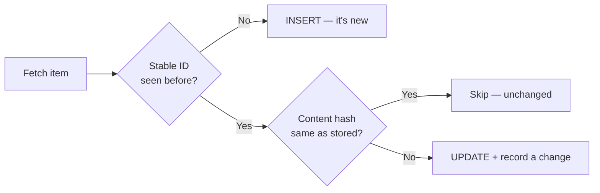

# Change Detection & Dedup

> **A scheduled scraper that re-saves the same rows every night is just an expensive clock. Store state, hash content, and record only what actually changed.**

⏱ ~8 min read · ~15 min hands-on
🔗 needs: [DuckDB + Parquet](/2026-02/docs/week-6/duckdb-parquet/) · [Scheduled Scraping](/2026-02/docs/week-6/scheduled-scraping/)

The first run of a scraper is the easy one. The interesting question is the second: *what's new?* Answer it with two cheap ideas — a **stable ID** for every record, and a **content hash** to detect edits.

## Try it in 5 minutes — hash a page, twice

```bash
curl -s https://quotes.toscrape.com/page/1/ | sha256sum
curl -s https://quotes.toscrape.com/page/1/ | sha256sum
```

✅ Identical hashes. If you'd stored the first one, the second fetch could be discarded in one comparison — no parsing, no writes, no duplicate rows.

## The two keys you need

| Key | What it answers | How to build it |
|---|---|---|
| **Stable ID** | "Have I seen this *item* before?" | A natural identifier: the canonical URL, a product SKU, an article permalink |
| **Content hash** | "Has this item *changed* since I saw it?" | `sha256` of the fields you care about, normalised |

Hash only the fields that matter. Include a timestamp, a view counter, or an ad slot and *everything* looks changed on every run.



## SQLite holds the state

This is exactly the OLTP job [SQLite is built for](/2026-02/docs/week-6/duckdb-parquet/): small, keyed, frequent lookups. One table, one `UPSERT`, and your scraper becomes incremental:

```python
# /// script
# requires-python = ">=3.12"
# dependencies = ["httpx>=0.28"]
# ///
"""Incremental scrape: insert new quotes, update changed ones, skip the rest.

Run it twice — the second run should report 0 new, 0 changed.
  uv run incremental.py
"""

import hashlib
import sqlite3

import httpx

DB = sqlite3.connect("state.db")
DB.execute("""
    CREATE TABLE IF NOT EXISTS quotes (
        id           TEXT PRIMARY KEY,   -- stable ID
        author       TEXT,
        text         TEXT,
        content_hash TEXT,               -- change detector
        first_seen   TEXT DEFAULT (datetime('now')),
        last_seen    TEXT
    )
""")


def content_hash(*fields: str) -> str:
    """Hash only the meaningful fields, normalised."""
    joined = "\x1f".join(f.strip().lower() for f in fields)
    return hashlib.sha256(joined.encode()).hexdigest()


def upsert(quote: dict) -> str:
    stable_id = content_hash(quote["text"])[:16]  # the text itself identifies the quote
    digest = content_hash(quote["text"], quote["author"]["name"])

    row = DB.execute("SELECT content_hash FROM quotes WHERE id = ?", (stable_id,)).fetchone()
    if row is None:
        DB.execute(
            "INSERT INTO quotes (id, author, text, content_hash, last_seen)"
            " VALUES (?, ?, ?, ?, datetime('now'))",
            (stable_id, quote["author"]["name"], quote["text"], digest),
        )
        return "new"
    if row[0] != digest:
        DB.execute(
            "UPDATE quotes SET author = ?, text = ?, content_hash = ?, last_seen = datetime('now')"
            " WHERE id = ?",
            (quote["author"]["name"], quote["text"], digest, stable_id),
        )
        return "changed"
    DB.execute("UPDATE quotes SET last_seen = datetime('now') WHERE id = ?", (stable_id,))
    return "unchanged"


if __name__ == "__main__":
    counts = {"new": 0, "changed": 0, "unchanged": 0}
    with httpx.Client(timeout=10) as client:
        page = 1
        while True:
            data = client.get(
                "https://quotes.toscrape.com/api/quotes", params={"page": page}
            ).raise_for_status().json()
            for q in data["quotes"]:
                counts[upsert(q)] += 1
            if not data["has_next"]:
                break
            page += 1
    DB.commit()
    print(counts)
```

Run it once: `{'new': 100, 'changed': 0, 'unchanged': 0}`. Run it again: `{'new': 0, 'changed': 0, 'unchanged': 100}`. That's an incremental scraper.

## Deleted items and history

`last_seen` quietly gives you two more capabilities:

- **Disappearances** — anything whose `last_seen` is older than your last successful run is gone from the source. Mark it inactive rather than deleting; that's a data point too.
- **History** — to keep *every* version rather than just the latest, append each `(id, content_hash, scraped_at, payload)` to a Parquet file. SQLite tracks current state; Parquet is your archive → [DuckDB + Parquet](/2026-02/docs/week-6/duckdb-parquet/).

## When it fails

| Symptom | Cause | Fix |
|---|---|---|
| Everything "changed" every run | Hashing volatile fields (timestamps, counters, ads) | Hash only stable content fields |
| Duplicates of the same item | ID derived from a URL with tracking params | Canonicalise: strip `utm_*`, sort query params |
| Nothing ever marked changed | Hashing the ID fields only | Hash the *content*, not the key |
| Whitespace-only diffs | No normalisation | `.strip()`, collapse whitespace, casefold before hashing |
| Everything vanishes after a failed run | Treating a partial run as authoritative | Only mark items missing after a run that *completed* |

## Your turn (≈15 min)

1. Run `incremental.py` twice; confirm the second run shows `unchanged: 100`.
2. Manually corrupt one row (`UPDATE quotes SET content_hash='x' WHERE rowid=1`) and re-run — it should report `changed: 1`.
3. Add a `runs` table recording `(started_at, finished_at, new, changed)` so you have an audit trail.
4. Add the disappearance check: list items whose `last_seen` predates the current run.

## Checklist

- [ ] I give every scraped record a stable ID that survives re-runs.
- [ ] I hash only meaningful content fields, normalised.
- [ ] I can report new / changed / unchanged counts after each run.
- [ ] I canonicalise URLs before using them as identifiers.
- [ ] I detect disappeared items with `last_seen`, and never trust a partial run.

## Go deeper

- [SQLite UPSERT](https://www.sqlite.org/lang_upsert.html) — do insert-or-update in a single statement.
- [`hashlib` — Python docs](https://docs.python.org/3/library/hashlib.html) — the hashing side.
- [changedetection.io](https://github.com/dgtlmoon/changedetection.io) — a ready-made service for the "just tell me when this page changes" case.

<!-- SOURCES: https://www.sqlite.org/lang_upsert.html , https://docs.python.org/3/library/hashlib.html , https://github.com/dgtlmoon/changedetection.io , https://quotes.toscrape.com -->
