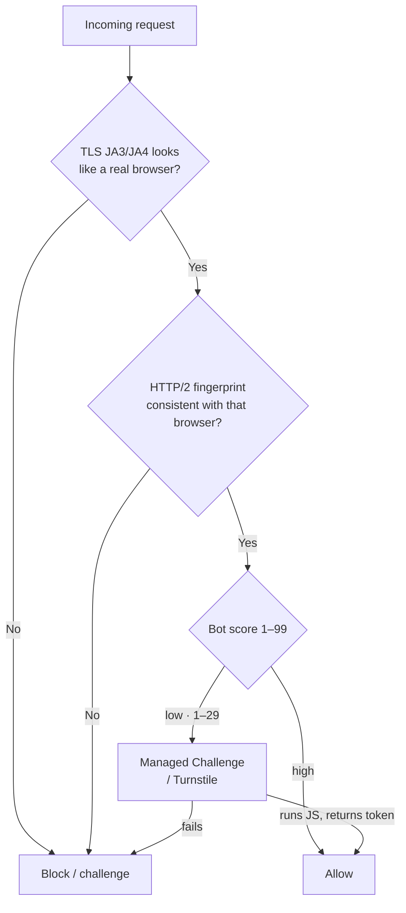

# Cloudflare Bot Protection

> **Understand *exactly* how Cloudflare decides you're a bot — then use the legitimate ways through, and know what it costs to fetch a page anyway.**

⏱ ~10 min read · ~15 min hands-on
🔗 needs: [Anti-bot Patterns](/2026-02/docs/week-6/anti-bot-patterns/) · [Hidden JSON APIs](/2026-02/docs/week-6/hidden-json-apis/) · [Legal & Ethical Scraping](/2026-02/docs/week-6/legal-ethical-scraping/)

Cloudflare sits in front of a large share of the web. A plain `httpx` or `requests` call often gets a `403` or an endless "checking your browser" loop, while Chrome loads the same page instantly. That gap isn't magic — it's four specific signals. Once you can name them, you know your options.

> ⚖️ This page teaches how detection works so you can access data **you are allowed to** — your own sites, sandboxes, or targets you have permission for. Getting past a bot wall does **not** grant permission; Terms and law still decide. See [Legal & Ethical Scraping](/2026-02/docs/week-6/legal-ethical-scraping/).

## Try it in 5 minutes — see the fingerprint gap

The first thing Cloudflare inspects is your TLS handshake, before a single header is read. `tls.peet.ws` echoes back the fingerprint it sees, so you can compare a Python client with a browser-impersonating one:

```python
# /// script
# requires-python = ">=3.12"
# dependencies = ["httpx>=0.28", "curl_cffi>=0.7"]
# ///
"""See why Cloudflare can tell a Python client from a browser — by its TLS fingerprint.

Run:  uv run tls_gap.py
"""

import httpx
from curl_cffi import requests as cffi

ECHO = "https://tls.peet.ws/api/all"  # echoes back the TLS fingerprint it sees


def show(label: str, get) -> None:
    tls = get(ECHO).json()["tls"]
    print(f"{label:20} JA3={tls['ja3_hash']}  JA4={tls['ja4']}")


show("httpx (Python)", lambda u: httpx.get(u, timeout=10))
show("curl_cffi(chrome)", lambda u: cffi.get(u, impersonate="chrome", timeout=10))
```

✅ Two **different** JA3 hashes. Cloudflare sees the same difference — and the bare-Python fingerprint is the one on its watch-list. You changed nothing about your headers; the TLS handshake alone gave you away.

## Why Cloudflare flags you — four signals



| Signal | What it checks | Why a bare Python client fails |
|---|---|---|
| **TLS JA3 / JA4** | Cipher + extension order in the TLS ClientHello | Python's OpenSSL stack hashes differently from Chrome's BoringSSL |
| **HTTP/2 fingerprint** | SETTINGS frame, header order, priority | `httpx`/`requests` send a different HTTP/2 profile than a browser |
| **JS / Turnstile challenge** | Runs JavaScript, probes the browser runtime, issues a `cf_clearance` token | A bare HTTP client has no JS engine — it can't complete the challenge |
| **Bot score (1–99)** | ML over IP, ASN, and behaviour; low = bot | A datacenter IP with no history scores low before you do anything |

Cloudflare's own docs describe the [bot score](https://developers.cloudflare.com/bots/concepts/bot-score/) (1 = certainly automated, 99 = certainly human) and [JA3/JA4 fingerprinting](https://developers.cloudflare.com/bots/additional-configurations/ja3-ja4-fingerprint/).

## The legitimate ways through — try these first

Before you spend a day matching fingerprints, spend five minutes looking for a door that's already open:

1. **Official API, data feed, or sitemap.** Faster and stable. See [Sitemaps, RSS & Structured Data](/2026-02/docs/week-6/sitemaps-rss-jsonld/).
2. **Public archives.** [Wayback Machine & Common Crawl](/2026-02/docs/week-6/wayback-commoncrawl/) already have the page — and Cloudflare never sees you.
3. **Ask.** Email the operator for an API key or permission. Many say yes.
4. **You own the site?** Allow-list your own crawler in the Cloudflare dashboard. (Running Cloudflare on *your* API is [Week 7](/2026-02/docs/week-7/cloudflare-defender/).)

## When you must fetch it yourself — matching a real browser

For a target you're permitted to access, you close the gaps in order of effort:

- **Passive fingerprints → `curl_cffi`.** Impersonates a browser's TLS (JA3/JA4) and HTTP/2 profile with no browser at all — fast, and enough when there's no JS challenge. ([github.com/lexiforest/curl_cffi](https://github.com/lexiforest/curl_cffi))
- **Active JS / Turnstile → a stealth browser.** When a challenge must actually run JavaScript, drive a real browser patched to hide automation: **Patchright** ([drop-in Playwright](https://github.com/Kaliiiiiiiiii-Vinyzu/patchright-python)) or **Camoufox** ([anti-detect Firefox](https://github.com/daijro/camoufox)).
- **Then reuse the token.** Solve the challenge once in the browser, grab the `cf_clearance` cookie, and make fast follow-up requests with `curl_cffi` — but see the binding gotcha below.

## When it fails

| Symptom | Cause | Fix |
|---|---|---|
| `403` even with perfect headers | TLS/HTTP2 fingerprint says "Python" | Use `curl_cffi` with `impersonate=` |
| Stuck in a "checking your browser" loop | An interactive JS/Turnstile challenge | TLS impersonation isn't enough — use Patchright/Camoufox |
| Worked once, then blocked | `cf_clearance` is bound to your **IP + User-Agent** | Reuse the *same* IP and UA for the harvested cookie |
| Blocked instantly from a server | Datacenter ASN scores poorly | A clean residential/ISP IP scores far higher than AWS/GCP ranges |
| Turnstile widget never resolves headless | Needs a real browser runtime | Run non-headless, or a stealth browser build |

## Your turn (≈15 min)

1. Run `tls_gap.py` and record the two JA3 hashes. In one sentence, explain which one Cloudflare blocks and why.
2. Add a third line that impersonates a different browser (`impersonate="safari"`), and confirm the fingerprint changes again.
3. Visit Cloudflare's public [Turnstile demo](https://developers.cloudflare.com/turnstile/) and watch a *managed challenge* run in your own browser — that JS is exactly what a bare HTTP client can't do.
4. **Defender's view (optional):** skim how you'd put this protection in front of *your own* API — [Week 7 → Cloudflare (defender's side)](/2026-02/docs/week-7/cloudflare-defender/).

## Checklist

- [ ] I can name the four signals Cloudflare uses: TLS JA3/JA4, HTTP/2 fingerprint, JS/Turnstile, bot score.
- [ ] I can explain why a `403` can happen before my headers are even read.
- [ ] I know when TLS impersonation (`curl_cffi`) is enough and when I need a stealth browser.
- [ ] I know `cf_clearance` is bound to IP + User-Agent, and that datacenter IPs score badly.
- [ ] I check for an API, feed, or archive **before** trying to match a browser.

## Go deeper

- [Cloudflare Bots docs — bot score](https://developers.cloudflare.com/bots/concepts/bot-score/) and [JA3/JA4 fingerprinting](https://developers.cloudflare.com/bots/additional-configurations/ja3-ja4-fingerprint/) — the mechanism, from the source.
- [curl_cffi](https://github.com/lexiforest/curl_cffi) — browser TLS/JA3 + HTTP/2 impersonation in Python.
- [Patchright](https://github.com/Kaliiiiiiiiii-Vinyzu/patchright-python) · [Camoufox](https://github.com/daijro/camoufox) — stealth browsers for JS challenges.
- [Playwright Web Scraping Tutorial — Become 100% Undetectable! — Thomas Janssen](https://youtu.be/afobK3UbTeE) — Playwright → Patchright, hands-on.

[](https://youtu.be/afobK3UbTeE "Playwright Web Scraping Tutorial — Become 100% Undetectable! — Thomas Janssen")

<!-- SOURCES: https://developers.cloudflare.com/bots/concepts/bot-score/ , https://developers.cloudflare.com/bots/additional-configurations/ja3-ja4-fingerprint/ , https://developers.cloudflare.com/turnstile/ , https://github.com/lexiforest/curl_cffi , https://github.com/Kaliiiiiiiiii-Vinyzu/patchright-python , https://github.com/daijro/camoufox , https://tls.peet.ws/api/all , https://youtu.be/afobK3UbTeE -->
