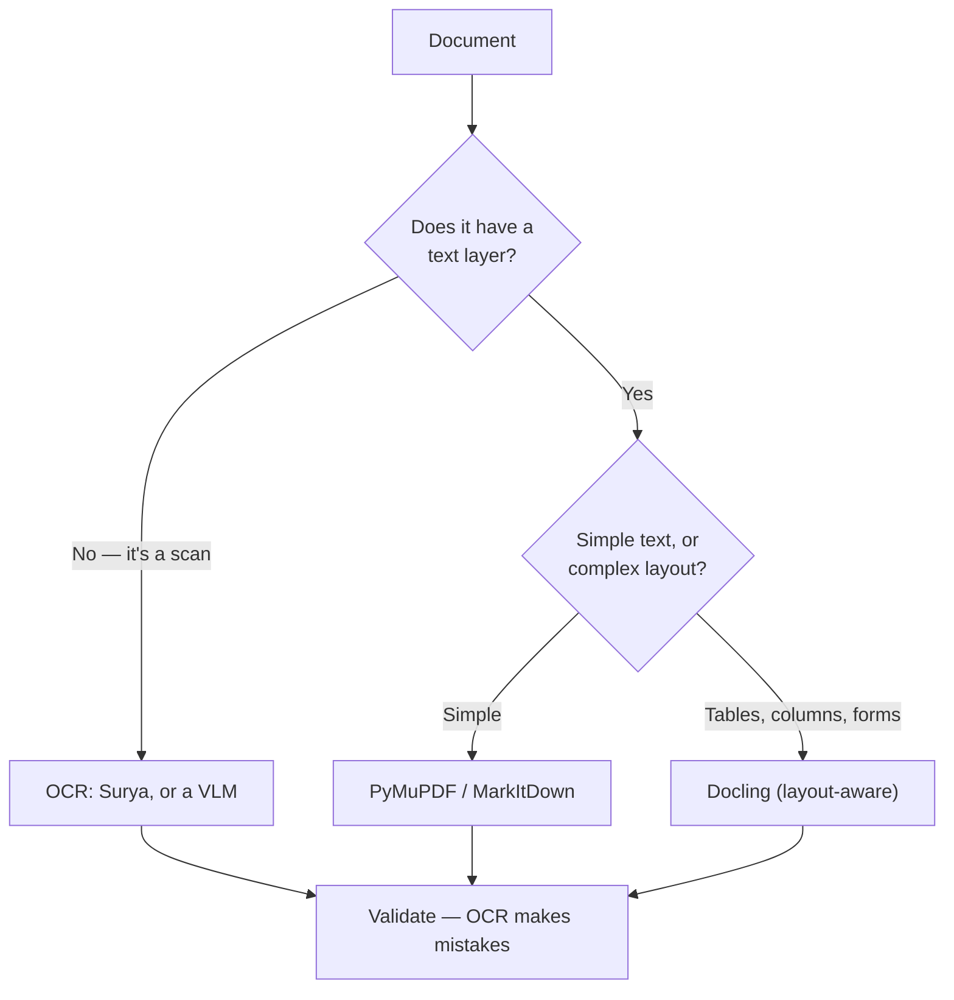

# Document Parsing

> **Most of the world's data is trapped in PDFs, Word files, and scans. Getting it out cleanly — with tables intact — is its own skill.**

⏱ ~8 min read · ~15 min hands-on
🔗 needs: [HTML → Markdown](/2026-02/docs/week-6/html-to-markdown/) · [Vision Models for Scraping](/2026-02/docs/week-6/vision-models-for-scraping/)

A PDF isn't a document format so much as a set of drawing instructions. There's often no "table" in there at all — just text positioned at coordinates that *look* like a table. That's why naive extraction produces scrambled columns, and why picking the right tool matters.

## Try it in 5 minutes

```python
# /// script
# requires-python = ">=3.12"
# dependencies = ["pymupdf>=1.24", "httpx>=0.28"]
# ///
"""Extract text and tables from a PDF.

Run:  uv run parse_pdf.py
"""

import httpx
import pymupdf  # PyMuPDF

url = "https://www.w3.org/WAI/ER/tests/xhtml/testfiles/resources/pdf/dummy.pdf"
open("sample.pdf", "wb").write(httpx.get(url, timeout=30, follow_redirects=True).content)

doc = pymupdf.open("sample.pdf")
for page_no, page in enumerate(doc, start=1):
    print(f"--- page {page_no} ---")
    print(page.get_text().strip()[:500])
    for table in page.find_tables():
        print("TABLE:", table.extract())
```

✅ Text plus any detected tables. If the text comes back **empty**, the page is a scan — an image of text — and you need OCR.

## Pick by document type

| Document | Tool | Why |
|---|---|---|
| Digital PDF (text layer) | **[PyMuPDF](https://pymupdf.readthedocs.io/)** | Fast, accurate, built-in table detection |
| Complex layouts, mixed formats | **[Docling](https://github.com/docling-project/docling)** | Layout-aware; PDF/DOCX/PPTX → structured Markdown |
| Anything → Markdown, quickly | **[MarkItDown](https://github.com/microsoft/markitdown)** | One API for PDF, DOCX, PPTX, XLSX, images |
| Scanned pages / images | **[Surya](https://github.com/datalab-to/surya)** or a **[VLM](/2026-02/docs/week-6/vision-models-for-scraping/)** | Real OCR; multilingual, layout-aware |
| Tables specifically | **[Camelot](https://camelot-py.readthedocs.io/)** / PyMuPDF `find_tables()` | Purpose-built for ruled and whitespace tables |



## Always convert to Markdown for LLMs

Whatever the source, land on Markdown before an LLM sees it: it keeps headings and tables meaningful while dropping the noise, exactly as in [HTML → Markdown](/2026-02/docs/week-6/html-to-markdown/). Preserve **page numbers** as you go — citations become verifiable, which matters enormously for [RAG grounding](/2026-02/docs/week-4/llm-grounding/).

## When it fails

| Symptom | Cause | Fix |
|---|---|---|
| `get_text()` returns "" | Scanned image, no text layer | OCR with Surya or a VLM |
| Columns interleaved | Multi-column layout read line-by-line | Use a layout-aware parser (Docling) |
| Table becomes one blob | No ruling lines to detect | `find_tables()` strategies, Camelot, or a VLM |
| Ligatures/spacing mangled | Font encoding quirks (`fi`, missing spaces) | Normalise Unicode; spellcheck-style cleanup |
| Huge PDF exhausts memory | Loading it all at once | Stream page by page |

## Your turn (≈15 min)

1. Run `parse_pdf.py` on the sample, then on a real PDF (a paper, a government report).
2. Find one with a table; compare `find_tables()` against copy-pasting from a PDF viewer.
3. Take a *scanned* PDF — confirm the text layer is empty, then OCR one page.
4. Convert one document to Markdown keeping page numbers, and write the citation line you'd attach to an extracted fact.

## Checklist

- [ ] I can tell a digital PDF from a scan by checking for a text layer.
- [ ] I know which tool suits which document type.
- [ ] I extract tables with a purpose-built method, not string splitting.
- [ ] I convert to Markdown before feeding an LLM, keeping page numbers.
- [ ] I validate extracted numbers — parsers and OCR both make mistakes.

## Go deeper

- [PyMuPDF docs](https://pymupdf.readthedocs.io/) — text, tables, images, page streaming.
- [Docling](https://github.com/docling-project/docling) — layout-aware conversion to structured Markdown.
- [Surya OCR](https://github.com/datalab-to/surya) — multilingual OCR and layout analysis.

<!-- SOURCES: https://pymupdf.readthedocs.io/ , https://github.com/docling-project/docling , https://github.com/microsoft/markitdown , https://github.com/datalab-to/surya , https://camelot-py.readthedocs.io/ -->
