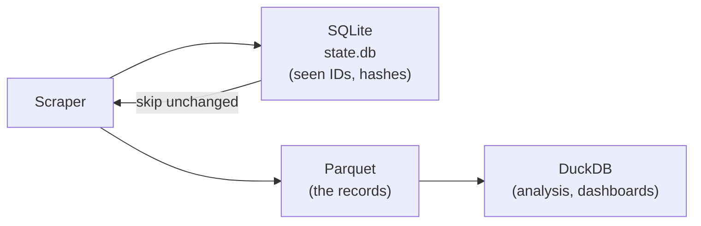

# DuckDB + Parquet (and SQLite for state)

> **Two databases, two jobs: SQLite remembers what your scraper has seen; DuckDB answers questions about what it collected — straight off Parquet files, no server.**

⏱ ~9 min read · ~15 min hands-on
🔗 needs: [SQLite](/2026-02/docs/week-1/05-sqlite/) · [Hidden JSON APIs](/2026-02/docs/week-6/hidden-json-apis/)

Scraped data has two very different access patterns, and using one tool for both is why people end up with a 4 GB CSV they can't open.

| | **SQLite** (OLTP) | **DuckDB** (OLAP) |
|---|---|---|
| Job | Scraper **state**: seen-IDs, hashes, last-seen | **Analysis**: aggregate millions of rows |
| Pattern | Many tiny keyed reads/writes | Few huge scans over columns |
| In Week 6 | [Change Detection & Dedup](/2026-02/docs/week-6/change-detection-dedup/) | This page |

Both run in-process — no server, no Docker.

## Try it in 5 minutes — query a file with SQL

If you ran the script on [Hidden JSON APIs](/2026-02/docs/week-6/hidden-json-apis/) you already have `quotes.parquet`. Query it directly — no import, no schema, no load step:

```bash
uvx duckdb -c "SELECT author, count(*) n FROM 'quotes.parquet' GROUP BY author ORDER BY n DESC LIMIT 5"
```

✅ SQL over a file on disk. DuckDB read only the two columns it needed — that's the columnar advantage.

## Why Parquet, not CSV

| | CSV | Parquet |
|---|---|---|
| Types | Everything is a string | Real types preserved |
| Size | Baseline | Typically **5–10× smaller** (columnar + compression) |
| Reading one column | Parse every byte | Read only that column |
| Schema | None | Embedded |

**Rule:** CSV to hand a human a file; Parquet for everything your code touches.

```python
# /// script
# requires-python = ">=3.12"
# dependencies = ["duckdb>=1.1"]
# ///
"""Build a Parquet file, then query it — no server, no import step.

Run:  uv run duck_demo.py
"""

import duckdb

# Generate a million rows and write Parquet directly from SQL.
duckdb.sql("""
    COPY (
        SELECT
            i                                  AS id,
            'author_' || (i % 50)              AS author,
            (i * 7919) % 1000                  AS score
        FROM range(1_000_000) t(i)
    ) TO 'demo.parquet' (FORMAT parquet)
""")

# Query the file. Only the columns referenced are read off disk.
duckdb.sql("""
    SELECT author, count(*) AS n, round(avg(score), 1) AS avg_score
    FROM 'demo.parquet'
    GROUP BY author
    ORDER BY avg_score DESC
    LIMIT 5
""").show()
```

## The patterns worth memorising

```sql
-- Read many files at once with a glob
SELECT * FROM 'scraped/*.parquet';

-- Convert CSV → Parquet in one statement
COPY (SELECT * FROM 'big.csv') TO 'big.parquet' (FORMAT parquet);

-- Query JSON straight from a scrape
SELECT * FROM read_json_auto('results.json');

-- Query a remote file without downloading it (httpfs autoloads)
SELECT count(*) FROM 'https://example.com/data.parquet';
```

DuckDB also reads Pandas and Polars DataFrames sitting in your Python session by name — handy mid-pipeline.

## How they fit together



SQLite decides *whether to write*; Parquet is *what you wrote*; DuckDB is *how you read it back*. Partition large collections by run date (`data/date=2026-08-07/part.parquet`) and the glob pattern gives you incremental analysis for free.

## When it fails

| Symptom | Cause | Fix |
|---|---|---|
| `Binder Error: No files found` | Relative path / wrong cwd | Use an absolute path; check the glob |
| Schema mismatch across files | Columns changed between runs | `union_by_name=true` in `read_parquet` |
| Out of memory on a huge query | Pulling everything into RAM | Aggregate in SQL; DuckDB spills to disk if given a file DB |
| Remote Parquet fails | `httpfs` unavailable / no network | `INSTALL httpfs; LOAD httpfs;` |
| Concurrent writer errors | Two processes writing one DuckDB file | Write separate Parquet files; read with a glob |

## Your turn (≈15 min)

1. Run `duck_demo.py`; compare `demo.parquet`'s size to the same data as CSV.
2. Re-run the aggregation over `'*.parquet'` with a glob.
3. Write your `quotes.parquet` from [Hidden JSON APIs](/2026-02/docs/week-6/hidden-json-apis/) and find the author with the most quotes.
4. Add a `scraped_date` column, write two dated files, and query both at once.

## Checklist

- [ ] I use SQLite for scraper state and DuckDB/Parquet for analysis.
- [ ] I save scraped datasets as Parquet, not CSV.
- [ ] I can query a Parquet file (or a glob of them) with SQL, no import step.
- [ ] I can convert CSV/JSON → Parquet in one statement.
- [ ] I know why columnar storage makes column-selective queries fast.

## Go deeper

- [DuckDB documentation](https://duckdb.org/docs/) — start with the Python API and Parquet pages.
- [Apache Parquet](https://parquet.apache.org/) — the format itself.
- [Change Detection & Dedup](/2026-02/docs/week-6/change-detection-dedup/) — the SQLite half of this story.

<!-- SOURCES: https://duckdb.org/docs/ , https://parquet.apache.org/ -->
