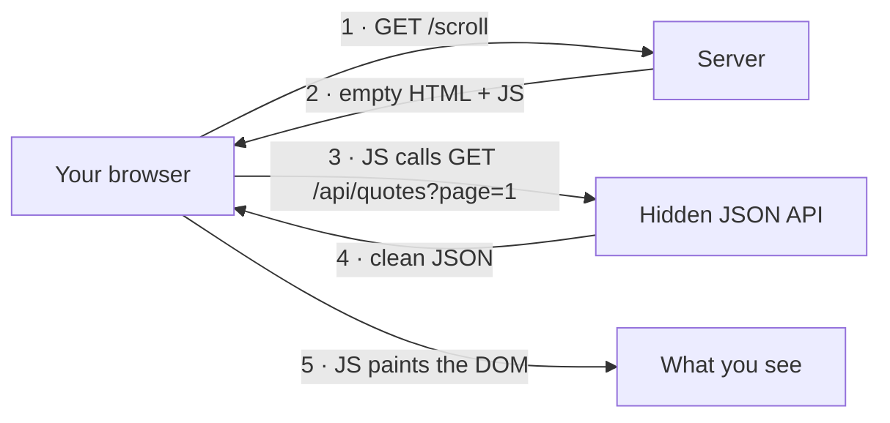

# Hidden JSON APIs

> **The page you want to scrape has already done the work for you.** Find the JSON endpoint its own JavaScript calls, and skip the HTML entirely.

⏱ ~8 min read · ~15 min hands-on
🔗 needs: [HTTP clients](/2026-02/docs/week-1/06-http-clients/) · browser DevTools (Network tab)

Most modern sites load a nearly-empty HTML shell, then fetch their real data as JSON from a backend API. If you find that request, you get clean, structured data — no brittle CSS selectors, no headless browser, often 100× faster. This is the **first thing to try** on any dynamic site, before you reach for Playwright.

## Try it in 5 minutes

We'll use [`quotes.toscrape.com/scroll`](https://quotes.toscrape.com/scroll) — a sandbox built for exactly this. It loads quotes as you scroll, so the data clearly isn't in the first HTML response.

1. Open <https://quotes.toscrape.com/scroll> in Chrome.
2. Open DevTools (`F12` or `Ctrl/Cmd+Shift+I`) → **Network** tab.
3. Click **Fetch/XHR** to filter out images, CSS, and fonts — leaving only data requests.
4. **Reload** the page and scroll down. Watch the rows appear.
5. Click the request to `api/quotes?page=1`. Open the **Response** tab — that's your data as JSON.
6. Right-click the request → **Copy** → **Copy as cURL**, and paste it into a terminal.

```bash
curl 'https://quotes.toscrape.com/api/quotes?page=1'
```

✅ You just got the same data the page shows — as structured JSON, with no browser and no HTML parsing.

## Why this works



The HTML at step 2 is a shell — the quotes aren't in it. The browser runs JavaScript (step 3) that calls the **real** data source. Scrapers that only read step 2's HTML find nothing; that's why people wrongly conclude "this site needs a browser."

**The shortcut:** call step 3 yourself and stop. You never need steps 1, 2, or 5.

Here's the full extraction as a self-contained script — no project setup, just `uv run`:

```python
# /// script
# requires-python = ">=3.12"
# dependencies = ["httpx>=0.28", "polars>=1.0"]
# ///
"""Pull every quote from quotes.toscrape.com's hidden JSON API into Parquet.

Run:  uv run hidden_api.py
"""

import httpx
import polars as pl

API = "https://quotes.toscrape.com/api/quotes"


def fetch_all() -> list[dict]:
    rows, page = [], 1
    # A Client reuses the TCP connection across pages — faster and politer.
    with httpx.Client(timeout=10, headers={"User-Agent": "tds-course-demo"}) as client:
        while True:
            # httpx's raise_for_status() returns the response, so we can chain .json()
            data = client.get(API, params={"page": page}).raise_for_status().json()
            for q in data["quotes"]:
                rows.append(
                    {
                        "text": q["text"],
                        "author": q["author"]["name"],
                        "tags": ", ".join(q["tags"]),
                    }
                )
            if not data["has_next"]:  # the API tells you when to stop
                break
            page += 1
    return rows


if __name__ == "__main__":
    rows = fetch_all()
    pl.DataFrame(rows).write_parquet("quotes.parquet")
    print(f"Saved {len(rows)} quotes to quotes.parquet")
```

Notice what the API handed you for free: a `has_next` flag so you know when to stop, and a stable page structure. You wrote a loop, not a fragile HTML parser.

> ⚖️ **Before you replay a request against a real site**, check its Terms of Service and `robots.txt`, and keep your rate low. An internal API being reachable is not the same as being allowed. See [Legal & Ethical Scraping](/2026-02/docs/week-6/legal-ethical-scraping/).

## When it fails

Copying the URL alone often isn't enough — the browser sent headers or cookies the server checks. Replay the **whole** request (that's why "Copy as cURL" copies the headers too), then strip pieces away until you find the minimum that still works.

| Symptom on replay | Likely cause | Fix |
|---|---|---|
| `403 Forbidden` | Server checks `Referer` / `User-Agent` / `X-Requested-With` | Send the same headers the browser did |
| `401 Unauthorized` | Endpoint needs a token | Copy the `Authorization` header or cookie from the request |
| Empty result, no error | Needs a session cookie set by the HTML page | Hit the page first with an `httpx.Client`, reuse its cookies |
| Works once, then blocks you | Rate limit or expiring token | Slow down; refresh the token → [Rate Limits, Retries & Caching](/2026-02/docs/week-6/rate-limits-retries-caching/) |
| No JSON anywhere in Fetch/XHR | Data is server-rendered into the HTML | This trick won't help — parse the HTML or use [Playwright](/2026-02/docs/week-6/playwright-selenium/) |

**Pro tip:** in the Network tab, use **Search** (`Ctrl/Cmd+F`) and type a value you can see on the page (an author's name, a price). It jumps straight to the request that contains it — faster than reading every row. Also look for URLs with `api`, `graphql`, `/v1/`, `.json`, or `query` in them.

## Your turn (≈15 min)

1. Run the script above with `uv run hidden_api.py` and confirm you get `quotes.parquet` (~100 rows).
2. Pick a **different** endpoint on the same sandbox: open [`quotes.toscrape.com/api/quotes?page=1`](https://quotes.toscrape.com/api/quotes?page=1) and add filtering — collect only quotes tagged `love`. (Hint: the JSON also carries a `tags` list per quote.)
3. Query your Parquet without loading it into Python — this is a one-liner with [DuckDB](/2026-02/docs/week-6/duckdb-parquet/):
   ```bash
   duckdb -c "SELECT author, count(*) n FROM 'quotes.parquet' GROUP BY author ORDER BY n DESC LIMIT 5"
   ```
4. **Stretch:** open the Network tab on a real site you use (a news site, a store) and just *find* its data API. Don't hammer it — one look is the exercise.

## Checklist

- [ ] I can filter the Network tab to **Fetch/XHR** and find the request that returns the data.
- [ ] I can use Network **Search** to jump to the request containing a value I see on the page.
- [ ] I can turn a browser request into a replayable one with **Copy as cURL**.
- [ ] I can replay it with `httpx` and know which **headers** decide success or a 403.
- [ ] I can recognise when a site has **no** hidden API and I need a browser instead.

## Go deeper

- [How I found the easiest way to scrape this site — John Watson Rooney](https://youtu.be/yUlq6AzfkII) — the network-tab technique, start to finish.
- [How to Scrape Hidden APIs — Scrapfly](https://scrapfly.io/blog/posts/how-to-scrape-hidden-apis) — headers, pagination, and auth patterns in depth.
- [Finding Undocumented APIs — Inspect Element](https://inspectelement.org/apis.html) — a friendly walk-through with real examples.
- [httpx Clients — official docs](https://www.python-httpx.org/advanced/clients/) — sessions, cookies, and connection reuse.

[](https://youtu.be/yUlq6AzfkII "How I found the easiest way to scrape this site — John Watson Rooney")
