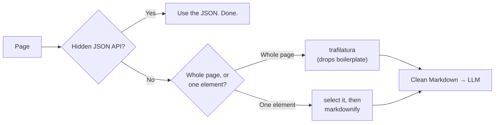

# HTML → Markdown for LLMs

> **Raw HTML is 90% navigation, scripts, and cookie banners. Strip it to clean Markdown and you cut your token bill while improving the model's answers.**

⏱ ~8 min read · ~12 min hands-on
🔗 needs: [Hidden JSON APIs](/2026-02/docs/week-6/hidden-json-apis/) · [Document Parsing](/2026-02/docs/week-6/document-parsing/)

Feeding raw HTML to an LLM wastes tokens on markup the model doesn't need and buries the actual content in boilerplate. Converting to Markdown first is one of the highest-leverage steps in any scrape-to-LLM pipeline.

> **First, though:** if the page has a [hidden JSON API](/2026-02/docs/week-6/hidden-json-apis/), use that instead. Structured JSON beats converted prose every time.

## Try it in 5 minutes

```python
# /// script
# requires-python = ">=3.12"
# dependencies = ["trafilatura>=2.0"]
# ///
"""Fetch a page and extract just the main article as clean Markdown.

Run:  uv run to_markdown.py https://en.wikipedia.org/wiki/Web_scraping
"""

import sys

import trafilatura

url = sys.argv[1] if len(sys.argv) > 1 else "https://en.wikipedia.org/wiki/Web_scraping"

downloaded = trafilatura.fetch_url(url)
markdown = trafilatura.extract(downloaded, output_format="markdown", with_metadata=True)

print(markdown[:1500])
print(f"\n--- HTML {len(downloaded):,} chars → Markdown {len(markdown):,} chars ---")
```

✅ Note the size drop — typically 80–95%. That reduction is your token bill, and everything removed was noise.

## Pick the right tool

| Tool | Use it for | Note |
|---|---|---|
| **[trafilatura](https://trafilatura.readthedocs.io/)** | Article/main-content extraction from web pages | Best default: strips nav, ads, footers. `output_format="markdown"` |
| **[markdownify](https://pypi.org/project/markdownify/)** | Faithful HTML→MD of a fragment you already isolated | Converts *everything* — no boilerplate removal |
| **[MarkItDown](https://github.com/microsoft/markitdown)** | PDFs, DOCX, PPTX, XLSX, images → Markdown | Microsoft; many formats, one API → [Document Parsing](/2026-02/docs/week-6/document-parsing/) |
| **[Jina Reader](https://jina.ai/reader/)** | One hosted call: `https://r.jina.ai/<url>` | Zero setup, renders JS; a third party sees your URLs |

The distinction that matters: **trafilatura decides what's worth keeping**; **markdownify converts whatever you hand it**. Use trafilatura on a full page, markdownify on a `<div>` you already selected.



## Local or hosted?

Self-hosting (trafilatura/markdownify) is free, private, and has no rate limit — this is the role a managed API like Firecrawl used to play, and it's a few lines of code. A hosted reader is worth it when the page needs JavaScript rendering and you don't want to run a browser; the cost is that you send every URL to a third party.

## When it fails

| Symptom | Cause | Fix |
|---|---|---|
| Empty output | JS-rendered page — no content in the HTML | Render with [Playwright](/2026-02/docs/week-6/playwright-selenium/) first, then convert |
| Main content dropped | Aggressive extraction on an unusual layout | Loosen with `favor_recall=True`, or select the element yourself + markdownify |
| Nav/ads still present | Used markdownify on the whole page | Use trafilatura, or select the content node first |
| Tables mangled | Complex/nested tables | `include_tables=True`; for real data prefer the [underlying API](/2026-02/docs/week-6/hidden-json-apis/) |
| Links lost | Default drops them | `include_links=True` |

## Your turn (≈12 min)

1. Run `to_markdown.py` on a Wikipedia article; record the HTML → Markdown size ratio.
2. Run it on a news article. Did the byline and date survive with `with_metadata=True`?
3. Compare against `https://r.jina.ai/<same-url>` — which is cleaner?
4. Estimate the token saving: `chars / 4 ≈ tokens`. At $3/M input tokens, what did you save on 10,000 pages?

## Checklist

- [ ] I check for a JSON API before converting HTML at all.
- [ ] I use trafilatura for whole pages, markdownify for isolated fragments.
- [ ] I know an empty extraction usually means JS rendering is required.
- [ ] I can estimate the token/cost saving from the size reduction.

## Go deeper

- [trafilatura documentation](https://trafilatura.readthedocs.io/en/latest/usage-python.html) — options for links, tables, metadata, recall.
- [MarkItDown](https://github.com/microsoft/markitdown) — the many-formats converter.
- [Jina Reader](https://jina.ai/reader/) — hosted `r.jina.ai/<url>`.

<!-- SOURCES: https://trafilatura.readthedocs.io/en/latest/usage-python.html , https://pypi.org/project/markdownify/ , https://github.com/microsoft/markitdown , https://jina.ai/reader/ -->
