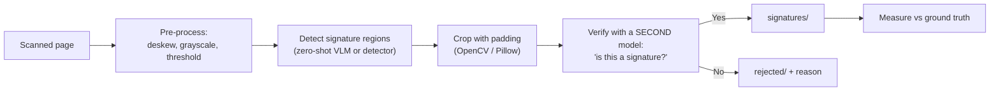

# Capstone — AI Signature Detection & Cropper

> Find handwritten signatures on scanned documents, crop them out, verify them with a second model, and be honest about your error rate.

⏱ ~6–8 hours
🔗 needs: [Vision Models for Scraping](/2026-02/docs/week-6/vision-models-for-scraping/) · [Image Processing Pipeline](/2026-02/docs/week-6/image-processing-pipeline/) · [Document Parsing](/2026-02/docs/week-6/document-parsing/)

A realistic document-AI pipeline: detect a region, crop it, and use a **second, independent** model to check the first one. The interesting engineering is in the verification and the measurement, not the detection call.

> ⚖️ **Use synthetic or public-domain documents only.** Generate your own signed documents, or use openly-licensed samples (e.g. the [Tobacco800](https://paperswithcode.com/dataset/tobacco-800) signature-detection corpus). **Never use real signed documents belonging to other people** — a signature is biometric personal data, and a cropped-signature dataset is a forgery resource. Build your test set yourself, and say how in the README.

## What you're building

## Requirements

**1. Build a test set with ground truth.** At least 30 document images: some with one signature, some with several, and **some with none** (the negative cases are where naive pipelines fail). Record the true bounding boxes, or at minimum the true signature *count* per page, in a `ground_truth.json`.

**2. Pre-process.** Grayscale, deskew, and threshold before detection — see [Image Processing Pipeline](/2026-02/docs/week-6/image-processing-pipeline/). Show a before/after for one image.

**3. Detect.** Locate candidate signature regions. Any approach is acceptable — a zero-shot vision model prompted for bounding boxes, an object detector, or classical CV (contour analysis on ink-dense regions). **Justify your choice**, and note that classical CV is a legitimate answer here if it works.

**4. Crop.** Extract each region with a small padding margin, saving as individual files named so they trace back to the source page and region.

**5. Verify with an independent second model.** Pass each crop to a *different* model than the detector and ask a binary question ("Is this a handwritten signature? Answer yes or no."). Enforce a schema on the answer. Rejected crops go to `rejected/` **with the reason** — never silently discarded.

**6. Measure and report — this is the graded core.** Against your ground truth, report **precision, recall, and F1**, plus:
- How many pages with **no** signature produced a false positive
- Three failure cases with the images and your diagnosis
- Whether the second model actually caught anything the first got wrong, *with counts*

A pipeline reported as "it works well" scores poorly. A pipeline reported as "precision 0.71, recall 0.88, and here's exactly where it breaks" scores well.

## Deliverables

| # | Item |
|---|---|
| 1 | Repo with the pipeline, runnable end-to-end on a folder |
| 2 | Your test set + `ground_truth.json` (and how you built it) |
| 3 | `RESULTS.md`: precision/recall/F1, confusion counts, 3 annotated failures |
| 4 | Sample cropped outputs and the `rejected/` folder with reasons |
| 5 | A short note on cost/latency per page |

## Grading

| Weight | Criterion |
|---|---|
| 30% | **Evaluation honesty** — real metrics against real ground truth, failures shown |
| 20% | **Two-stage design** — the verifier is genuinely independent and measurably useful |
| 20% | **Pipeline quality** — pre-processing, sensible cropping, nothing silently dropped |
| 15% | **Negative cases** — behaves correctly on pages with no signature |
| 15% | **Reproducibility & ethics** — runs from the README; synthetic/public data only |

## Common failure modes

| Symptom | Cause | Fix |
|---|---|---|
| Every logo detected as a signature | Prompt too loose | Tighten the prompt; use the verifier stage |
| Boxes slightly off | Model coordinates are approximate | Add padding; snap to contours |
| Nothing found on faint scans | No pre-processing | Threshold and boost contrast first |
| Metrics look perfect | Test set too easy / no negatives | Add hard and empty pages |
| Non-deterministic results | Model temperature | Pin low temperature; report variance |

## Stretch goals

- Compare a zero-shot VLM against classical CV on the same set — which wins, and at what cost per page?
- Redact instead of extract: blur every detected signature and output a shareable document.
- Report a calibration curve: does the model's stated confidence track its actual accuracy?
