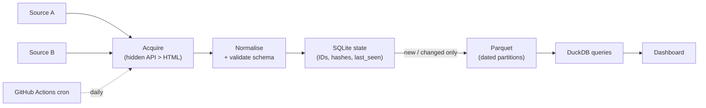

# Capstone — Job Posting Scraper & Tracker

> Build a scraper that runs itself, notices what changed, and answers questions about the market.

⏱ ~6–8 hours
🔗 needs: [Hidden JSON APIs](/2026-02/docs/week-6/hidden-json-apis/) · [Change Detection & Dedup](/2026-02/docs/week-6/change-detection-dedup/) · [DuckDB + Parquet](/2026-02/docs/week-6/duckdb-parquet/) · [Scheduled Scraping](/2026-02/docs/week-6/scheduled-scraping/)

Anyone can scrape a page once. This capstone is about the harder, more valuable thing: a pipeline that runs unattended for weeks, doesn't duplicate data, doesn't get banned, and produces a dataset worth querying.

> ⚖️ **Choose your targets before you write code.** Read each site's `robots.txt` and Terms. Prefer sites with a public API or feed, and job boards that permit it. Job posts contain **personal data** (recruiter names, emails) — collect only the fields your questions need, and never publish personal contact details. Your submission must include the [decision record](/2026-02/docs/week-6/legal-ethical-scraping/) for each source. A source you can't justify is a source you don't scrape.

## What you're building



## Requirements

**1. Acquire — two different sources.** At least two job sources, each justified in your decision record.
- Try hardest for a [hidden JSON API](/2026-02/docs/week-6/hidden-json-apis/); most job boards have one. Document how you found it (or why there isn't one).
- Fall back to [Playwright](/2026-02/docs/week-6/playwright-selenium/) only where necessary, and say why.
- Handle [pagination](/2026-02/docs/week-6/pagination-infinite-scroll/) with an explicit stop condition and a `MAX_PAGES` cap.
- Be polite: [rate limits, backoff, and caching](/2026-02/docs/week-6/rate-limits-retries-caching/).

**2. Normalise — a validated schema.** Every record conforms to a Pydantic model; rows that fail are quarantined with the reason, not silently dropped.

```python
class JobPosting(BaseModel):
    job_id: str            # stable ID, derived from the canonical URL
    title: str
    company: str
    location: str | None
    salary_min: int | None  # parse "₹12–18 LPA" into numbers where you can
    salary_max: int | None
    posted_date: date | None
    url: str
    source: str
    content_hash: str      # over the meaningful fields only
```

**3. Track state incrementally.** SQLite holds `job_id`, `content_hash`, `first_seen`, `last_seen`. A second run on unchanged data must report **0 new, 0 changed**. Detect *removed* postings via `last_seen` — a job disappearing is a signal (filled or expired).

**4. Store as dated Parquet.** `data/date=YYYY-MM-DD/postings.parquet`, so DuckDB can glob the history.

**5. Schedule it.** A [GitHub Actions cron](/2026-02/docs/week-6/scheduled-scraping/) running daily that commits only when data changed, and fails loudly if it collects suspiciously few rows.

**6. Answer questions.** A DuckDB-backed dashboard (Streamlit, or static HTML + a generated JSON) showing at least:
- Postings per day, and the trend over your collection window
- Top companies and locations hiring
- Salary distribution where parseable
- **Churn**: how many postings appeared and disappeared this week

## Deliverables

| # | Item |
|---|---|
| 1 | Public repo: scraper, dashboard, `README.md` with setup |
| 2 | **Decision record** per source: robots/ToS, four legality questions, verdict |
| 3 | Actions run history showing ≥5 successful scheduled runs on different days |
| 4 | The Parquet dataset (or a sample if large) |
| 5 | Live dashboard link, or a screenshot plus run instructions |
| 6 | A short `FINDINGS.md`: three things the data told you, with the query for each |

## Grading

| Weight | Criterion |
|---|---|
| 20% | **Acquisition** — found the real data source; polite; handles pagination |
| 20% | **Correctness** — schema validated; idempotent; a re-run yields 0 new/0 changed |
| 15% | **Automation** — genuinely runs unattended; commits only on change; fails loudly |
| 15% | **Storage & querying** — sensible Parquet layout; DuckDB queries that answer real questions |
| 15% | **Dashboard** — readable, honest, and actually driven by your data |
| 15% | **Ethics & judgment** — decision record, data minimisation, no personal contact details |

## Stretch goals

- Fuzzy-match the same role posted across both sources (entity resolution).
- Extract required skills from descriptions with an LLM into a validated schema — then measure how often it's wrong.
- Alert (email/Discord) when a posting matching your criteria appears.
- Backfill history from the [Wayback Machine](/2026-02/docs/week-6/wayback-commoncrawl/) to extend your window past your start date.

## Checklist before you submit

- [ ] Running twice in a row reports 0 new, 0 changed.
- [ ] A deliberately broken selector makes the run **fail**, not write empty data.
- [ ] No API keys or `auth.json` in the repo.
- [ ] No personal contact details in the dataset.
- [ ] Every source has a written decision record.
- [ ] A stranger can clone the repo and run it from the README alone.
