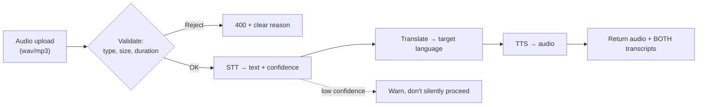

# Capstone — Live Multilingual Travel Translator

> Speech in, speech out, in another language — a three-model pipeline where every stage can fail, and your job is to make the whole thing not fall over.

⏱ ~6–8 hours
🔗 needs: [Speech AI](/2026-02/docs/week-6/speech-ai/) · [FastAPI](/2026-02/docs/week-2/01-fastapi/) · [Structured Output](/2026-02/docs/week-3/structured-output/)

Chaining STT → translation → TTS is easy to demo and hard to make reliable: errors compound, latency stacks, and each stage has its own failure mode. This capstone is graded on the engineering around the models.

> ⚖️ **Voice is biometric personal data.** Use your own voice, synthetic audio, or openly-licensed clips. Don't upload recordings of other people without their consent, don't retain audio longer than a request needs, and don't build voice cloning of a real person.

## What you're building



## Requirements

**1. A FastAPI endpoint.** `POST /translate` taking an audio file plus a `target_language`, returning the synthesised audio **and** both the source transcript and the translated text. Returning only audio is a failure — users must be able to see what it *heard*, because that's where errors originate.

**2. Validate input properly.** Reject wrong content types, oversized files, and zero-length audio with useful 4xx messages. Cap duration; a 40-minute upload should be refused, not processed.

**3. STT with confidence.** Use [faster-whisper](/2026-02/docs/week-6/speech-ai/) (or equivalent). Surface the detected language and its probability. If confidence is low, say so in the response rather than confidently mistranslating noise.

**4. Translate.** Any LLM or translation API, with a schema-validated response ([Structured Output](/2026-02/docs/week-3/structured-output/)) — never a raw free-text blob you then regex.

**5. TTS.** Hosted (OpenAI TTS, ElevenLabs) or local (Piper). Handle the case where the target language has no available voice — degrade gracefully to text-only with an explicit flag.

**6. Engineer for failure.** Every stage gets a timeout. A stage failure returns a clear error naming *which* stage failed, never a 500 with a stack trace. Log per-stage latency with a request ID ([observability](/2026-02/docs/week-2/09-observability/)).

**7. Measure quality honestly.** Take **10 test clips**, at least three in an Indian language, and report per clip:

```
clip | true text | STT output | WER | translation | fluent? (your judgment) | total latency
```

Then write which stage contributes the most error. Usually it's STT on accented or noisy audio — and demonstrating that you *measured* it is the point.

## Deliverables

| # | Item |
|---|---|
| 1 | Repo with the API, `README.md`, and `curl` examples |
| 2 | Deployed endpoint ([Cloud Run](/2026-02/docs/week-7/07-serverless-functions/) or similar) — or a recorded demo if deployment isn't feasible |
| 3 | `EVALUATION.md` with the 10-clip table and your error analysis |
| 4 | A latency breakdown per stage |
| 5 | Your test clips (self-recorded or openly licensed) |

## Grading

| Weight | Criterion |
|---|---|
| 25% | **Pipeline works** end-to-end, returning audio plus both transcripts |
| 25% | **Evaluation** — real WER numbers, Indian-language coverage, error attribution |
| 20% | **Robustness** — validation, timeouts, per-stage errors, graceful degradation |
| 15% | **Observability** — per-stage latency and cost, request IDs |
| 15% | **Ethics & docs** — consented audio, no retention, reproducible README |

## Common failure modes

| Symptom | Cause | Fix |
|---|---|---|
| Hallucinated text on silence | Whisper on quiet audio | `vad_filter=True`; check confidence |
| Wrong language detected | Short or code-mixed clip | Let the user specify the source language |
| Timeout on long audio | Whole file in one request | Cap duration; chunk; consider a [queue](/2026-02/docs/week-7/10-pubsub-event-driven/) |
| Translation drops meaning | No context given to the model | Prompt with domain/context; validate schema |
| No voice for the language | TTS coverage gaps | Detect and degrade to text with a flag |

## Stretch goals

- Stream results so the transcript appears before the audio finishes.
- Add a glossary so place names and proper nouns survive translation.
- Compare Whisper against Parakeet on your Indian-language clips and report the WER difference.
- Cache by audio hash so repeated clips skip the pipeline entirely.
