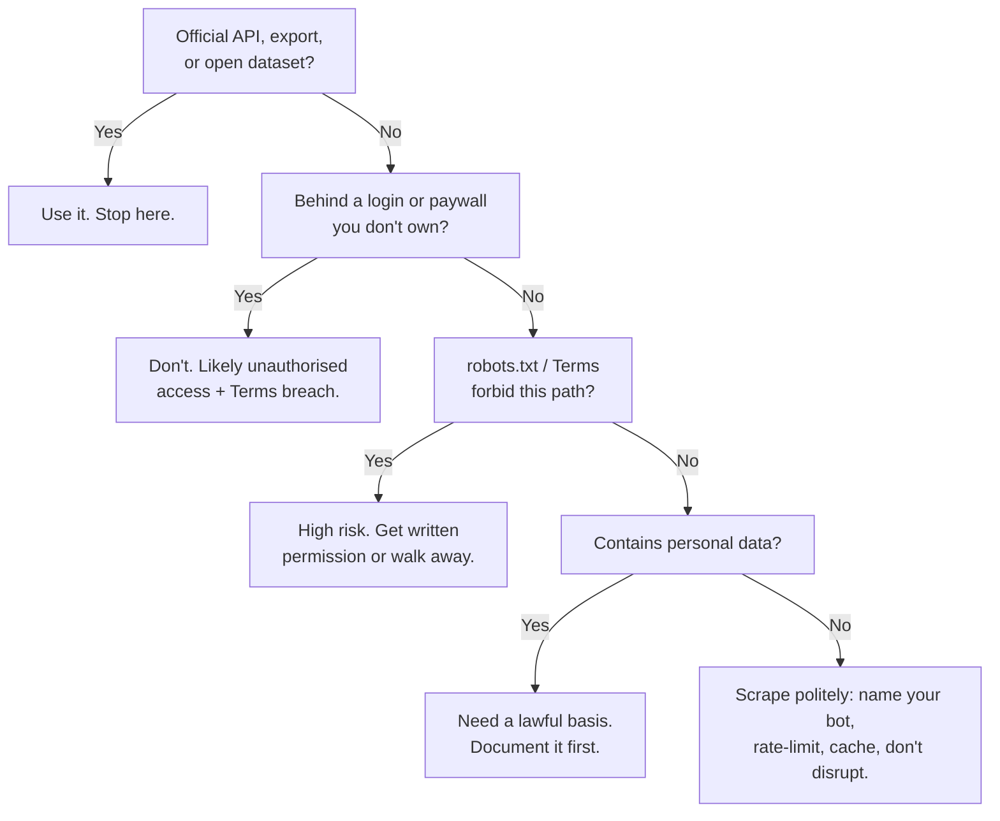

# Legal & Ethical Scraping

> **"It's public" does not mean "you're allowed."** Learn to answer *"can I scrape this?"* before you write a line of code — and how to stay on the right side of the line.

⏱ ~9 min read · ~15 min hands-on
🔗 needs: nothing · read this **before** every other Week 6 page

> ℹ️ This is a practical engineering guide, **not legal advice**. Laws differ by country and change often. When money, personal data, or a company's core assets are involved, ask a lawyer.

Scraping sits at the intersection of four different bodies of law, plus the operator's own rules. Most people learn this the expensive way. You won't.

## Run this before every scrape

A 60-second pre-flight that catches 90% of trouble:

1. **Look for the front door.** Is there an official API, data export, RSS feed, or open dataset? If yes, use it and stop — it's faster *and* safer. ([Sitemaps, RSS & JSON-LD](/2026-02/docs/week-6/sitemaps-rss-jsonld/) shows how to find these.)
2. **Read `robots.txt`.** Visit `https://SITE/robots.txt`. It tells you which paths the operator asks bots to avoid.
3. **Skim the Terms of Service.** Search the page for "scrap", "crawl", "automated", "bot". An explicit ban changes everything (see hiQ, below).
4. **Ask: is this personal data?** Names, emails, photos, profiles, reviews tied to a person → a much stricter regime applies.
5. **Decide your rate.** Never faster than a human could plausibly browse. Identify your bot honestly in the `User-Agent`.

Here's a dependency-free checker for steps 2 and the crawl-delay — pure standard library:

```python
# /// script
# requires-python = ">=3.12"
# ///
"""Check whether a path is allowed by a site's robots.txt, and its crawl-delay.

Run:  uv run robots_check.py https://www.google.com/search
"""

import sys
from urllib.parse import urlsplit
from urllib.robotparser import RobotFileParser

UA = "tds-course-bot"  # be honest about who you are


def check(url: str, ua: str = UA) -> None:
    parts = urlsplit(url)
    rp = RobotFileParser()
    rp.set_url(f"{parts.scheme}://{parts.netloc}/robots.txt")
    rp.read()
    verdict = "ALLOWED" if rp.can_fetch(ua, url) else "DISALLOWED"
    print(f"{verdict}  {url}")
    if delay := rp.crawl_delay(ua):
        print(f"Crawl-delay: {delay}s between requests")


if __name__ == "__main__":
    check(sys.argv[1] if len(sys.argv) > 1 else "https://www.google.com/search")
```

Run it against `https://www.google.com/search` — you'll see `DISALLOWED`, because Google's `robots.txt` blocks `/search`. That's the kind of thing worth knowing *before* your scraper hits it 10,000 times.

## Can I scrape this?



## The four questions that decide legality

| Question | The law in play | What tips it against you |
|---|---|---|
| **Access** — is it public? | Computer fraud statutes (US CFAA, India ITA §43/66) | Bypassing a login, paywall, or technical block you weren't given keys to |
| **Contract** — did you accept Terms? | Breach of contract | A ToS that bans scraping — *especially* click-through terms you clicked, or scraping that continues after a cease-and-desist |
| **Content** — who owns it? | Copyright, database rights | Copying substantial creative content or a whole database and republishing it |
| **Person** — is it about people? | GDPR (EU), DPDP Act (India), CCPA (California) | Collecting personal data at scale without a lawful basis |

You need a *yes-you're-fine* on **all four**, not just one. "The data was public" only answers the first.

## What the courts actually said

**hiQ v. LinkedIn** is the case everyone cites — and usually gets half-right. Over six years, the Ninth Circuit twice held that scraping LinkedIn's *public* profiles likely did **not** violate the CFAA (public data, no "unauthorised access"). Scrapers cheered. But in **November 2022** the district court found hiQ had **breached LinkedIn's User Agreement** by scraping and using fake profiles, and the case ended in a **consent judgment, a permanent injunction barring hiQ from scraping LinkedIn, and a $500,000 payment**. hiQ later folded.

> **The lesson:** "public + no hacking" can still be **breach of contract**. The Terms of Service is a real legal instrument. Read it.

**Clearview AI** is the personal-data cautionary tale: it scraped billions of public photos to build a face-search tool and was fined **€20 million** each by regulators in Italy, Greece, France, and the UK. Public photos were still *personal data*, and "it was on the open web" was no defence.

## Personal data: GDPR and India's DPDP

If your scrape touches data about identifiable people, this is the part that bites hardest.

- **GDPR (EU):** public personal data is *still* personal data. The usual basis for scraping is **legitimate interest** (Art. 6(1)(f)), but that requires a documented **balancing test** weighing your purpose against the person's rights. France's regulator (**CNIL**) now treats **respecting `robots.txt`** as a factor in whether that interest is legitimate — another reason not to ignore it.
- **India — DPDP Act 2023:** the **DPDP Rules were notified on 14 November 2025**, with a staggered rollout; the **substantive obligations take effect on 14 May 2027**. It governs "digital personal data" of people in India, centres on **consent**, and applies even to freely available data once it identifies a person. If you're an IITM student scraping Indian sites, this is *your* regime — get familiar now, before enforcement lands.

Rule of thumb: **aggregate, non-personal facts** (prices, weather, sport scores, public filings) are low-risk. **Anything tied to a named individual** needs a lawful basis and a good reason.

## Stop-lines — don't cross these

- Data behind a login, paywall, or CAPTCHA that exists to *keep you out* of something you don't own.
- Personal data collected at scale with no lawful basis or genuine purpose.
- Scraping that continues after an explicit cease-and-desist or account ban.
- Anything that **degrades the service** — hammering a small site is closer to a denial-of-service than to research.
- Re-publishing someone's copyrighted content or whole database as your own.

When in doubt, **email the site owner and ask.** A surprising number say yes — and now you have permission in writing.

## Your turn (≈15 min)

Write a **scrape decision record** — a short paragraph you'd be comfortable showing a lawyer — for one real site you'd like to scrape:

1. Run the `robots_check.py` script above against a URL you care about.
2. Find and quote the one line in the site's Terms about automated access (or note there isn't one).
3. Answer the four questions (Access / Contract / Content / Person) in one sentence each.
4. Write your verdict: **scrape / scrape-with-limits / don't** — and *why*.

Keep it. Real teams attach exactly this to a scraping project before it starts.

## Checklist

- [ ] I check `robots.txt` and search the Terms **before** writing a scraper.
- [ ] I can explain why "the data is public" does not settle legality (hiQ).
- [ ] I know that public *personal* data still falls under GDPR / DPDP (Clearview).
- [ ] I know India's DPDP substantive provisions take effect **14 May 2027**.
- [ ] I identify my bot honestly, rate-limit, and cache so I never hit a site twice for the same thing.

## Go deeper

- [The Robots Exclusion Protocol — RFC 9309](https://www.rfc-editor.org/rfc/rfc9309.html) — what `robots.txt` actually means, as a standard.
- [LinkedIn v. hiQ: lessons for scrapers — Morgan Lewis](https://www.morganlewis.com/blogs/sourcingatmorganlewis/2022/12/linkedin-v-hiq-landmark-data-scraping-suit-provides-guidance-to-data-scrapers-and-web-operators) — the breach-of-contract outcome, explained.
- [Enforcement of the DPDP Act and the DPDP Rules — Shardul Amarchand Mangaldas](https://www.amsshardul.com/insight/enforcement-of-the-dpdp-act-and-notification-of-the-dpdp-rules/) — India's timeline in plain English.
- [Is Website Scraping Legal? — GDPR Local](https://gdprlocal.com/is-website-scraping-legal-all-you-need-to-know/) — the GDPR/personal-data angle for scrapers.
