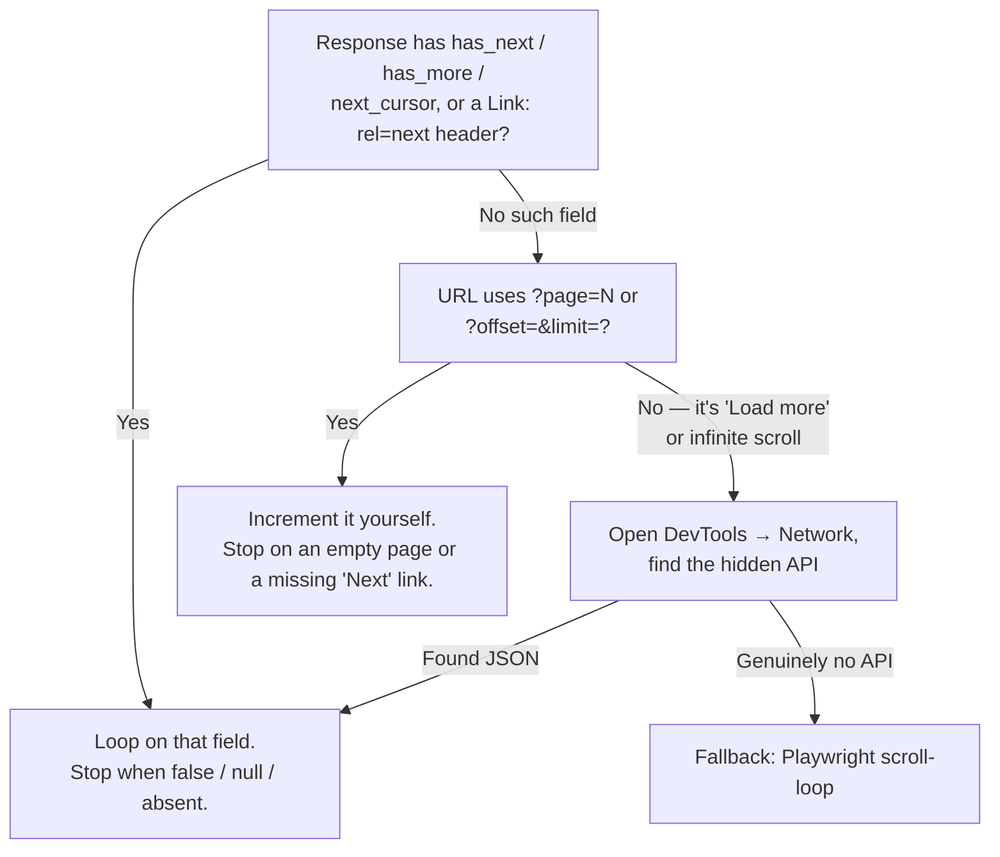

# Pagination & Infinite Scroll

> **"Load more" is a button wired to a loop.** Find what it increments — a page number or a cursor token — and the signal that says stop, and you can fetch every result without clicking it.

⏱ ~6 min read · ~15 min hands-on
🔗 needs: [Hidden JSON APIs](/2026-02/docs/week-6/hidden-json-apis/) · [HTTP clients](/2026-02/docs/week-1/06-http-clients/)

Any list longer than one screen — search results, a catalog, a feed — is paginated somehow: page numbers, a "Load more" button, or an endless scrollbar. Reach for this the moment you see one; skip it if the first response already returns everything (check for a `total`/`count` field first).

## Try it in 5 minutes

We'll reuse the hidden API from [Hidden JSON APIs](/2026-02/docs/week-6/hidden-json-apis/) — [`quotes.toscrape.com/api/quotes`](https://quotes.toscrape.com/api/quotes?page=1) — but now walk every page instead of just finding it.

1. Fetch page 1:
   ```bash
   curl -s 'https://quotes.toscrape.com/api/quotes?page=1' | jq '{page, has_next, count: (.quotes | length)}'
   ```
   `{"page": 1, "has_next": true, "count": 10}` — a page number you control, a flag for "more exists."
2. Jump to the last real page:
   ```bash
   curl -s 'https://quotes.toscrape.com/api/quotes?page=10' | jq '{page, has_next, count: (.quotes | length)}'
   ```
   `has_next` flips to `false` — your stop signal, no counting required.
3. Request a page **past** the end:
   ```bash
   curl -s 'https://quotes.toscrape.com/api/quotes?page=11' | jq '{page, has_next, count: (.quotes | length)}'
   ```
   Still `200 OK`, still `has_next: false`, but `count: 0` — a second, independent stop signal.

✅ You found both stop signals a paginated API can hand you — a flag, and an empty page — using nothing but curl.

## Find the loop, then find the stop

Every pagination scheme answers two questions: *what do I send for the next batch*, and *how do I know to stop*. Nearly everything reduces to one of two shapes:

| | **Offset / page** | **Cursor / token** |
|---|---|---|
| You send | `?page=3` or `?offset=20&limit=10` — a number **you** compute | `?cursor=xyz…` — an opaque string **the server** gave you |
| Stop signal | `has_next`/`has_more`, an empty page, or a missing "Next" link | A `next_cursor`/`continue` field: present means more, absent means done |
| Seen above | `quotes.toscrape.com` — `page` + `has_next` | — |
| Real example | [GitHub REST API](https://docs.github.com/en/rest/using-the-rest-api/using-pagination-in-the-rest-api) — `Link: <...>; rel="next"` | [Stripe's List API](https://docs.stripe.com/api/pagination) — `starting_after`; Wikipedia's API — a `continue` token |
| Confuse them and… | Harmless — you increment past the real end | Costly — reuse an old cursor and refetch the same page forever |

Cursors exist because offsets get slow on huge, changing datasets — the server hands you a bookmark instead of recomputing "skip 4,930,000 rows" every call. You can't guess or skip ahead with one; you can only forward the exact value the *previous* response gave you.

"Load more" buttons and infinite scroll are UI wrapped around one of these two shapes — the click handler or scroll listener calls a JSON endpoint with an incrementing page or a forwarded cursor. That's why [Hidden JSON APIs](/2026-02/docs/week-6/hidden-json-apis/) is a prerequisite: find that endpoint, then call it directly with a big `limit`/`page_size` instead of scripting a browser to scroll and click.



Only the last box needs a browser — see [Playwright & Selenium](/2026-02/docs/week-6/playwright-selenium/) for the scroll loop, and [Playwright Advanced](/2026-02/docs/week-6/playwright-advanced/) for waiting on network-idle and "load more" clicks reliably.

Here's the loop, written defensively — two stop signals checked, plus a hard cap so a wrong assumption fails loudly instead of running forever:

```python
# /// script
# requires-python = ">=3.12"
# dependencies = ["httpx>=0.28"]
# ///
"""Walk every page of a has_next-style API, defensively, and print the total.

Run:  uv run paginate.py
"""

import httpx

API = "https://quotes.toscrape.com/api/quotes"
MAX_PAGES = 50  # a safety cap — never trust a single stop condition alone


def paginate(client: httpx.Client):
    """Yield each page's items until the API says stop, or a page comes back empty."""
    page = 1
    while page <= MAX_PAGES:
        data = client.get(API, params={"page": page}).raise_for_status().json()
        items = data["quotes"]
        if not items:  # stop signal #1: nothing left, flag or not
            return
        yield items
        if not data["has_next"]:  # stop signal #2: the API says so directly
            return
        page += 1
    raise RuntimeError(f"Hit MAX_PAGES={MAX_PAGES} — check your stop condition")


if __name__ == "__main__":
    with httpx.Client(timeout=10, headers={"User-Agent": "tds-course-demo"}) as client:
        pages, total = 0, 0
        for batch in paginate(client):
            pages += 1
            total += len(batch)
    print(f"Walked {pages} pages, {total} quotes total")
```

Swap `page` for an `offset` you increment by `limit`, or for a `cursor` you read out of each response, and the shape of this loop doesn't change — only what you send, and what you check for "done", does.

> ⚖️ **A pagination loop can turn "one look" into ten thousand requests without you noticing.** Rate-limit and cache as you go — see [Rate Limits, Retries & Caching](/2026-02/docs/week-6/rate-limits-retries-caching/) — and check [Legal & Ethical Scraping](/2026-02/docs/week-6/legal-ethical-scraping/) before you paginate through anything that isn't a sandbox.

## When it fails

| Symptom | Likely cause | Fix |
|---|---|---|
| Loop runs for hundreds of pages and never stops | Wrong JSON key, or a typo (`hasNext` vs `has_next`) | Print the raw last response, confirm the exact field name, and always add a `MAX_PAGES` cap |
| Same rows repeat forever | The offset/page parameter isn't actually moving the server | Copy the **exact** query param from a real "Next" click in DevTools — sites use `page`, `p`, `pg`, `offset`, `skip`, `page_num`… |
| Works for two pages, then stalls or repeats | You reused an old cursor/token instead of the latest one | Always read the cursor fresh from the response you just got — never cache it across calls |
| `has_next: true` forever, but every page looks the same | You're being rate-limited and served a stale/cached response | Slow down → [Rate Limits, Retries & Caching](/2026-02/docs/week-6/rate-limits-retries-caching/) |
| `429` or a block partway through a long paginate run | No delay between dozens of back-to-back requests | Add backoff between pages → [Rate Limits, Retries & Caching](/2026-02/docs/week-6/rate-limits-retries-caching/) |
| Playwright infinite-scroll script never loads past the first screen | Scrolled before new content finished loading, or scrolled the wrong element | Wait for new DOM nodes / network-idle after each scroll → [Playwright & Selenium](/2026-02/docs/week-6/playwright-selenium/) |

## Your turn (≈15 min)

[`scrapethissite.com/pages/forms`](https://www.scrapethissite.com/pages/forms/?page_num=1) has no JSON API and no `has_next` field — just an HTML table and a `page_num=` in the URL. That makes it a better test of whether you understood the stop signals, not just copied the script above.

1. Open page 1, then [page 24](https://www.scrapethissite.com/pages/forms/?page_num=24), in your browser. Compare the pagination bar — page 24 is missing the "Next" arrow every earlier page has.
2. Write a script that requests `page_num=1, 2, 3, …`, and for each page counts the `<tr class="team">` rows (parse with [selectolax](https://pypi.org/project/selectolax/), or a plain string count while you're prototyping). Stop the first time a page comes back with **zero** rows, and print the running total.
3. You now have two valid stop signals for this site — a missing "Next" link, and an empty page. Which would you trust in an unattended script, and why?
4. **Stretch:** rerun `paginate.py` above with the `has_next` check deleted, relying only on the empty-page check. Confirm you land on the same total (100).

## Checklist

- [ ] I can tell offset/page pagination (`?page=`, `?offset=&limit=`) apart from cursor/token pagination (`next_cursor`, `continue`, `starting_after`) from one response.
- [ ] I know a paginated API can give two independent stop signals — a flag and an empty page — and I check for both.
- [ ] I know a "Load more" button or infinite scroll is UI wrapped around one of these two shapes, and I find the endpoint before I script a browser.
- [ ] I can detect the last page of a plain HTML table from a missing "Next" link or a short final page.
- [ ] I add a `MAX_PAGES` safety cap so a wrong stop condition fails loudly instead of looping forever.
- [ ] I know when to fall back to a Playwright scroll-loop — only when there's genuinely no API underneath.

## Go deeper

- [3 Ways To Scrape Infinite Scroll Sites with Playwright — John Watson Rooney](https://youtu.be/VDf7nfjLwRU) — the scroll-loop fallback, three different ways.
- [Using pagination in the REST API — GitHub Docs](https://docs.github.com/en/rest/using-the-rest-api/using-pagination-in-the-rest-api) — page-based pagination via the `Link` header, on a real, huge API.
- [Pagination — Stripe API Reference](https://docs.stripe.com/api/pagination) — cursor-based pagination via `starting_after`, from the company that popularized this pattern.
- [How to Scroll and Scrape With Playwright — ZenRows](https://www.zenrows.com/blog/playwright-scroll/) — scroll-to-bottom and click-to-load-more, for when there's truly no API.

[](https://youtu.be/VDf7nfjLwRU "3 Ways To Scrape Infinite Scroll Sites with Playwright — John Watson Rooney")

<!-- SOURCES: https://quotes.toscrape.com/api/quotes, https://www.scrapethissite.com/pages/forms/, https://docs.github.com/en/rest/using-the-rest-api/using-pagination-in-the-rest-api, https://docs.stripe.com/api/pagination, https://www.zenrows.com/blog/playwright-scroll/, https://youtu.be/VDf7nfjLwRU, https://pypi.org/project/selectolax/ -->
