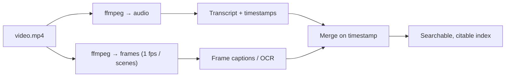

# Video Understanding

> **A video is frames plus audio plus time. Split it into those three, and a problem that looked impossible becomes three you already know how to solve.**

⏱ ~8 min read · ~12 min hands-on
🔗 needs: [Speech AI](/2026-02/docs/week-6/speech-ai/) · [Vision Models for Scraping](/2026-02/docs/week-6/vision-models-for-scraping/)

Never treat video as an opaque blob. Decompose it: **audio** → [transcript](/2026-02/docs/week-6/speech-ai/); **frames** → [vision models](/2026-02/docs/week-6/vision-models-for-scraping/); **time** → the index that ties them together.

## Try it in 5 minutes — ffmpeg is the whole toolkit

```bash
# One frame per second, numbered
ffmpeg -i video.mp4 -vf fps=1 frame_%04d.jpg

# Audio only, for transcription
ffmpeg -i video.mp4 -vn -acodec libmp3lame audio.mp3

# A single frame at 01:23
ffmpeg -ss 00:01:23 -i video.mp4 -frames:v 1 shot.jpg

# Duration and stream info as JSON
ffprobe -v quiet -print_format json -show_format -show_streams video.mp4
```

✅ Extraction, sampling, and metadata — four commands cover most of what a video pipeline needs.

Sampling every frame is almost always waste: at 30 fps, a 10-minute video is 18,000 near-identical images. **1 fps is a sane default**; scene-change detection is better still:

```bash
# Keep only frames where the scene actually changes
ffmpeg -i video.mp4 -vf "select='gt(scene,0.3)',showinfo" -vsync vfr scene_%03d.jpg
```

## The pipeline



Merging on the timestamp is what makes it powerful: you can then answer *"when was the pricing slide on screen, and what was being said?"* — a question neither audio nor frames could answer alone.

```python
# /// script
# requires-python = ">=3.12"
# ///
"""Turn ffprobe output into a shot list — no dependencies beyond ffmpeg.

Run:  uv run shotlist.py video.mp4
"""

import json
import subprocess
import sys

path = sys.argv[1] if len(sys.argv) > 1 else "video.mp4"

meta = json.loads(subprocess.run(
    ["ffprobe", "-v", "quiet", "-print_format", "json", "-show_format", "-show_streams", path],
    capture_output=True, text=True, check=True,
).stdout)

duration = float(meta["format"]["duration"])
video = next(s for s in meta["streams"] if s["codec_type"] == "video")
print(f"{duration:.0f}s  {video['width']}x{video['height']}  {video.get('avg_frame_rate')}")
print(f"Sampling at 1 fps → about {int(duration)} frames")
```

## Native video models

Some models now accept a video file directly and reason over **time** — "what happened after the person sat down?" — which frame-by-frame analysis handles poorly. [Qwen3-VL](https://github.com/QwenLM/Qwen3-VL) handles hour-long video with timestamp-level localisation among open weights; hosted Gemini models take video natively too.

Use native video for **temporal** questions. Use frames + transcript when you need cheap, auditable, citable extraction at scale — you keep the exact frame and timestamp behind every claim.

> ⚖️ Downloading video is governed by the platform's Terms, and faces in frames are personal data — [Legal & Ethical Scraping](/2026-02/docs/week-6/legal-ethical-scraping/). For lecture content, prefer official captions/transcripts where they exist.

## When it fails

| Symptom | Cause | Fix |
|---|---|---|
| Thousands of identical frames | Sampling every frame | `fps=1` or scene detection |
| `ffmpeg: command not found` | Not installed | `apt install ffmpeg` / `brew install ffmpeg` |
| Audio extraction fails | No audio stream | Check `ffprobe` streams first |
| Timestamps drift | Variable frame rate | Use `-vsync vfr`; trust `showinfo` times |
| Token costs explode | Sending every frame to a VLM | Scene-change frames only; caption once, cache |

## Your turn (≈12 min)

1. Download a short Creative Commons video and run `shotlist.py`.
2. Extract frames at 1 fps, then with scene detection — compare the counts.
3. Extract the audio and transcribe it with [Speech AI](/2026-02/docs/week-6/speech-ai/).
4. Merge: for a keyword in the transcript, print its timestamp and the nearest extracted frame.

## Checklist

- [ ] I decompose video into audio, frames, and time rather than treating it as a blob.
- [ ] I can extract frames, audio, a single timestamped shot, and metadata with ffmpeg/ffprobe.
- [ ] I sample at 1 fps or by scene change instead of every frame.
- [ ] I can merge transcript and frames on timestamps.
- [ ] I know when a native video model beats a frame pipeline.

## Go deeper

- [ffmpeg documentation](https://ffmpeg.org/ffmpeg.html) — filters, seeking, encoding.
- [ffprobe](https://ffmpeg.org/ffprobe.html) — structured metadata about any media file.
- [Qwen3-VL](https://github.com/QwenLM/Qwen3-VL) — open-weight video-capable vision-language models.

<!-- SOURCES: https://ffmpeg.org/ffmpeg.html , https://ffmpeg.org/ffprobe.html , https://github.com/QwenLM/Qwen3-VL -->
