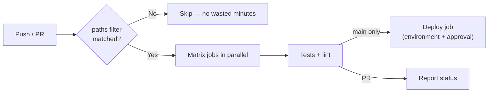

# GitHub Actions — Advanced

> **Once a workflow works, make it fast, safe, and reusable: cache the slow parts, matrix the repetitive parts, and stop handing every job write access to your repo.**

⏱ ~10 min read · ~20 min hands-on
🔗 needs: [Git & GitHub](/2026-02/docs/week-1/04-git-github/) · [Scheduled Scraping](/2026-02/docs/week-6/scheduled-scraping/)

You've used Actions to run a scheduled scraper. Production CI/CD adds three demands: it must be **fast** (nobody waits 20 minutes), **safe** (a workflow is code with access to your secrets), and **reusable** (don't copy-paste YAML across ten repos).

## Try it in 5 minutes — a matrix build with caching

```yaml
name: Test

on: [push, pull_request]

permissions:
  contents: read              # least privilege by default

jobs:
  test:
    runs-on: ubuntu-latest
    strategy:
      fail-fast: false        # let every combination report, not just the first failure
      matrix:
        python: ["3.12", "3.13"]
    steps:
      - uses: actions/checkout@v4
      - uses: astral-sh/setup-uv@v5
        with:
          enable-cache: true          # cache the dependency downloads
          cache-dependency-glob: "uv.lock"
      - run: uv python install ${{ matrix.python }}
      - run: uv sync --all-extras
      - run: uv run pytest -q
```

✅ One file, two parallel Python versions, dependencies cached between runs. `fail-fast: false` matters — otherwise one failure cancels the others and hides half your information.

## Make it fast

| Technique | Effect |
|---|---|
| **Cache dependencies** | Usually the single biggest win — skip re-downloading every run |
| **Matrix in parallel** | Wall-clock = slowest job, not the sum |
| **`paths:` filters** | Don't run the full suite when only `README.md` changed |
| **`concurrency`** | Cancel superseded runs on the same branch |

```yaml
concurrency:
  group: ${{ github.workflow }}-${{ github.ref }}
  cancel-in-progress: true    # a new push cancels the previous run
```

## Make it safe

A workflow runs code with access to your repository and secrets. Three rules:

1. **Least-privilege `permissions`.** Default to `contents: read` at the top; grant more only in the job that needs it.
2. **Pin third-party actions.** `uses: some/action@v3` is a moving target; a compromised tag runs in *your* pipeline. Pin to a full commit SHA for anything outside `actions/`.
3. **Never trust PR input.** `pull_request_target` runs with **write** permissions and access to secrets — combined with checking out the PR's code, it's a well-known privilege-escalation path. Prefer plain `pull_request` for untrusted contributions.

Secrets are masked in logs but leak through carelessness: never `echo` one, and remember anything a build script prints ends up in a public log on a public repo.



## Make it reusable

Stop copy-pasting. A **reusable workflow** is called by others:

```yaml
# .github/workflows/reusable-tests.yml
on:
  workflow_call:
    inputs:
      python-version: { type: string, default: "3.12" }
    secrets:
      API_KEY: { required: false }
```

```yaml
# in another repo/workflow
jobs:
  test:
    uses: your-org/ci-templates/.github/workflows/reusable-tests.yml@main
    with:
      python-version: "3.13"
    secrets: inherit
```

Use **environments** (`environment: production`) to gate deploys behind required reviewers — that's how you get a human approval step before anything reaches production.

## When it fails

| Symptom | Cause | Fix |
|---|---|---|
| Cache never hits | Key doesn't change with deps, or wrong path | Key off the lockfile hash |
| Secrets empty in a PR from a fork | By design — forks don't get secrets | Use `pull_request_target` **only** with extreme care, or a bot flow |
| `Resource not accessible by integration` | Missing `permissions` | Grant the specific scope needed |
| Matrix job cancels the rest | `fail-fast` defaults to true | `fail-fast: false` |
| Workflow doesn't trigger on a fork PR | Requires maintainer approval | Approve the run in the PR |
| Deploy ran on a feature branch | No branch condition | `if: github.ref == 'refs/heads/main'` |

## Your turn (≈20 min)

1. Add the matrix workflow to a repo; confirm both Python versions run in parallel.
2. Run it twice and compare timings — the cache should show a clear win.
3. Add `concurrency` with `cancel-in-progress`, push twice quickly, and watch the first run cancel.
4. Set `permissions: contents: read` and find the minimum scope your deploy job actually needs.
5. Extract your test job into a reusable workflow and call it from another repo.

## Checklist

- [ ] I cache dependencies keyed on the lockfile.
- [ ] I use a matrix with `fail-fast: false`.
- [ ] I set least-privilege `permissions` and pin third-party actions to a SHA.
- [ ] I know why `pull_request_target` is dangerous.
- [ ] I gate production deploys behind an environment with reviewers.

## Go deeper

- [Workflow syntax reference](https://docs.github.com/en/actions/reference/workflows-and-actions/workflow-syntax) — every key, authoritative.
- [Security hardening for GitHub Actions](https://docs.github.com/en/actions/reference/security/secure-use) — the risks above, in detail.
- [Reusing workflows](https://docs.github.com/en/actions/how-tos/reuse-automations/reuse-workflows) — `workflow_call` in full.

<!-- SOURCES: https://docs.github.com/en/actions/reference/workflows-and-actions/workflow-syntax , https://docs.github.com/en/actions/reference/security/secure-use , https://docs.github.com/en/actions/how-tos/reuse-automations/reuse-workflows -->
