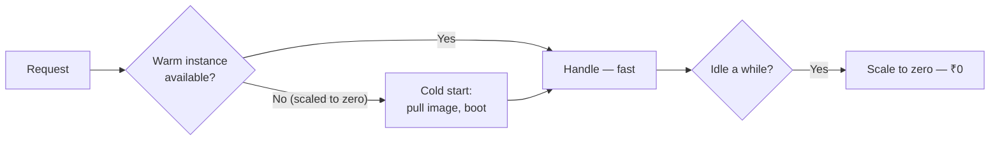

# Serverless Functions

> **Deploy code without owning a server, pay only while it runs, and scale to zero when nobody's looking — provided you design for a process that can vanish at any moment.**

⏱ ~9 min read · ~20 min hands-on
🔗 needs: [Deployment Platforms](/2026-02/docs/week-2/07-deployment-platforms/) · [Advanced Docker](/2026-02/docs/week-7/02-advanced-docker/)

Serverless is the natural home for the workloads this course produces: a scheduled scraper, a webhook receiver, an inference endpoint used a few hundred times a day. You ship a function or container; the platform handles machines, scaling, and idle cost.

## Try it in 5 minutes — deploy a container that scales to zero

Google **Cloud Run** takes any container that listens on `$PORT`:

```python
# /// script
# requires-python = ">=3.12"
# dependencies = ["fastapi>=0.110", "uvicorn>=0.27"]
# ///
"""A serverless-ready API: binds $PORT, stateless, has a health check.

Run locally: uv run app.py
"""

import os

import uvicorn
from fastapi import FastAPI

app = FastAPI()


@app.get("/health")
def health():
    return {"ok": True}


@app.get("/")
def root():
    return {"message": "Hello from serverless"}


if __name__ == "__main__":
    # The platform chooses the port and injects it. Never hard-code 8000.
    uvicorn.run(app, host="0.0.0.0", port=int(os.environ.get("PORT", 8080)))
```

```bash
gcloud run deploy my-api --source . --region asia-south1 --allow-unauthenticated
```

✅ A public HTTPS URL, autoscaling, and **zero cost while idle**. Two details make it work: bind `0.0.0.0` (not `127.0.0.1`) and read `$PORT` from the environment.

## The rules serverless imposes

| Rule | Why | Consequence |
|---|---|---|
| **Stateless** | Any request may hit a fresh instance | Never store session state in memory or on local disk |
| **Ephemeral disk** | The filesystem vanishes | Write to object storage or a database |
| **Bounded runtime** | Requests time out | Long jobs → queue + worker, or a [VM](/2026-02/docs/week-7/06-vms-ssh/) |
| **Cold starts** | Scale-to-zero means a first-request delay | Slim images; min-instances if latency matters |
| **Concurrency** | One instance may serve many requests | Code must be thread/async-safe |



## Picking a platform

| Platform | Best for |
|---|---|
| **Cloud Run** | Any container, generous limits, scale-to-zero — the flexible default |
| **AWS Lambda** | Deep AWS integration, event sources; size and runtime limits |
| **Cloudflare Workers** | Edge latency, tiny/fast JS-first workloads; not general Python |
| **Vercel / Netlify** | Frontends with API routes |
| **HF Spaces / Modal** | ML inference, GPUs on demand |

Cloud Run is the best fit for this course: it takes the Docker image from [Advanced Docker](/2026-02/docs/week-7/02-advanced-docker/) unchanged.

## Cold starts and cost

Cold start ≈ image pull + process boot + your imports. Shrink all three: slim multi-stage images, lazy-import heavy libraries, and avoid loading a model at module scope unless you also set a minimum instance count.

The flip side of scale-to-zero is **scale-to-many**: a traffic spike (or a bug, or a scraper hitting you) can launch hundreds of instances and a real bill. **Always set a max-instance cap** and an alert → [Cost Alerting](/2026-02/docs/week-7/09-cost-alerting/).

```bash
gcloud run deploy my-api --max-instances 10 --min-instances 0 --memory 512Mi
```

## When it fails

| Symptom | Cause | Fix |
|---|---|---|
| Container fails to start | Bound `127.0.0.1` or a fixed port | Bind `0.0.0.0`, read `$PORT` |
| Data disappears between requests | Local disk is ephemeral | Object storage or a database |
| First request slow, rest fast | Cold start | Slimmer image, lazy imports, min-instances |
| Long job times out | Exceeds the request limit | Queue + worker → [Pub/Sub](/2026-02/docs/week-7/10-pubsub-event-driven/) |
| Surprise bill | Unbounded autoscaling | `--max-instances` + budget alerts |
| Works locally, 403 deployed | Missing IAM/auth flag | Check invoker permissions |

## Your turn (≈20 min)

1. Deploy the app above to Cloud Run (or Lambda); hit `/health` over HTTPS.
2. Call it after several idle minutes and time the cold start, then again immediately — compare.
3. Set `--max-instances 3` and explain in one line what that protects you from.
4. Try writing a file in one request and reading it in the next; observe the failure and fix it with object storage.
5. Point your [scheduled scraper](/2026-02/docs/week-6/scheduled-scraping/) at it via a cloud scheduler instead of GitHub Actions.

## Checklist

- [ ] My service binds `0.0.0.0` on `$PORT`.
- [ ] It's stateless and writes nothing important to local disk.
- [ ] I know what a cold start is and how to reduce it.
- [ ] I always cap max instances and set a budget alert.
- [ ] I move long-running work to a queue + worker.

## Go deeper

- [Cloud Run documentation](https://cloud.google.com/run/docs) — deploy, configure, autoscale.
- [Container runtime contract](https://cloud.google.com/run/docs/container-contract) — the `$PORT`/stateless rules, precisely.
- [AWS Lambda docs](https://docs.aws.amazon.com/lambda/) — the event-driven alternative.

<!-- SOURCES: https://cloud.google.com/run/docs , https://cloud.google.com/run/docs/container-contract , https://docs.aws.amazon.com/lambda/ -->
