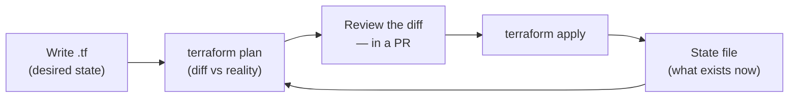

# Terraform & Infrastructure as Code

> **Clicking through a cloud console is undocumented, unrepeatable, and unreviewable. Declare your infrastructure in files, and `git log` becomes your change history.**

⏱ ~10 min read · ~20 min hands-on
🔗 needs: [Serverless Functions](/2026-02/docs/week-7/07-serverless-functions/) · [Git & GitHub](/2026-02/docs/week-1/04-git-github/)

Infrastructure as Code (IaC) means your cloud resources are declared in version-controlled files. You describe the **desired end state**; Terraform computes the diff and applies it. The wins are reproducibility, code review for infrastructure, and one command to tear a whole environment down.

## Try it in 5 minutes — declare, plan, apply

```hcl
# main.tf
terraform {
  required_providers {
    google = { source = "hashicorp/google", version = "~> 6.0" }
  }
}

provider "google" {
  project = var.project_id
  region  = "asia-south1"
}

variable "project_id" { type = string }

resource "google_storage_bucket" "scraped_data" {
  name                        = "${var.project_id}-scraped-data"
  location                    = "ASIA-SOUTH1"
  uniform_bucket_level_access = true
  force_destroy               = false        # guard against deleting real data

  lifecycle_rule {
    condition { age = 90 }                   # auto-delete objects after 90 days
    action    { type = "Delete" }
  }
}

output "bucket_url" {
  value = google_storage_bucket.scraped_data.url
}
```

```bash
terraform init      # download providers
terraform plan      # show what WOULD change — read this every time
terraform apply     # make it so
terraform destroy   # remove everything this config created
```

✅ `plan` before `apply`, always. It's a dry run that has prevented more outages than any other habit in this course.

## The core loop



Terraform keeps a **state file** mapping your config to real resources. That file is how it knows what already exists, and it is the part people get wrong.

## State: the part that bites

- **Never commit state to git.** It contains resource IDs and often **secrets in plaintext**.
- **Use a remote backend** so a team shares one state with locking. Two people running `apply` against local state will corrupt each other's work.

```hcl
terraform {
  backend "gcs" {
    bucket = "my-tfstate-bucket"
    prefix = "prod"
  }
}
```

- **Never hand-edit resources Terraform manages.** Console changes cause *drift*; the next `plan` will try to undo them. If you must, `terraform import` the resource so state matches reality.

## Habits worth forming early

| Habit | Why |
|---|---|
| Pin provider versions (`~> 6.0`) | A provider upgrade shouldn't change infrastructure |
| Separate environments (dir or workspace) | Never share state between dev and prod |
| Use variables + `terraform.tfvars` | No hard-coded project IDs; `.tfvars` stays out of git |
| Secrets from a secret manager, not `.tf` | `.tf` files are committed; secrets must not be |
| `plan` in CI on every PR | Reviewers see the infrastructure diff before merge |

Terraform in CI is where IaC pays off: post `plan` output on the PR, and `apply` only on merge to `main` — with an [environment approval gate](/2026-02/docs/week-7/01-github-actions-advanced/).

> ⚖️ `terraform destroy` and any plan showing `- destroy` on a stateful resource (database, bucket) deletes **real data**. Read every plan; set `force_destroy = false` and deletion protection on anything that matters.

## When it fails

| Symptom | Cause | Fix |
|---|---|---|
| "Resource already exists" | Created by hand outside Terraform | `terraform import` it into state |
| Plan wants to destroy/recreate | Changed an immutable field (e.g. name) | Check the diff; rename intentionally |
| State lock stuck | A crashed run | `terraform force-unlock <id>` — only when truly stale |
| Secret visible in state | Sensitive value stored by design | Remote backend + encryption + restricted access |
| Works for you, not a teammate | Local state | Move to a remote backend |
| Provider upgrade changed things | Unpinned version | Pin with `~>` and a lockfile |

## Your turn (≈20 min)

1. Create the bucket above with `plan` → `apply`; confirm it exists in the console.
2. Change the lifecycle age to 30 and run `plan` — read the diff before applying.
3. Delete the bucket **in the console**, then run `plan` again and watch Terraform detect the drift.
4. Move state to a remote backend and re-run `init`.
5. `terraform destroy` to clean up — and note exactly what it warns you it will delete.

## Checklist

- [ ] I always run `plan` and read the diff before `apply`.
- [ ] I never commit state files; I use a remote backend with locking.
- [ ] I pin provider versions.
- [ ] I don't hand-edit Terraform-managed resources.
- [ ] I keep secrets out of `.tf` files.
- [ ] I `destroy` course resources so they stop costing money.

## Go deeper

- [Terraform documentation](https://developer.hashicorp.com/terraform/docs) — language, CLI, workflow.
- [Remote state backends](https://developer.hashicorp.com/terraform/language/backend) — sharing state safely.
- [OpenTofu](https://opentofu.org/) — the open-source fork, near-identical syntax.

<!-- SOURCES: https://developer.hashicorp.com/terraform/docs , https://developer.hashicorp.com/terraform/language/backend , https://opentofu.org/ -->
