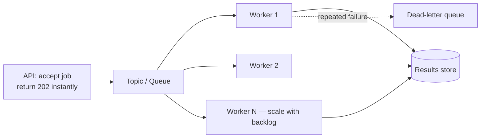

# Pub/Sub & Event-Driven Architecture

> **Stop making the caller wait. Drop a message on a queue, return immediately, and let workers do the slow part — with retries you didn't have to write.**

⏱ ~9 min read · ~20 min hands-on
🔗 needs: [Serverless Functions](/2026-02/docs/week-7/07-serverless-functions/) · [Async & Parallelism](/2026-02/docs/week-5/async-parallelism/)

Your scraper takes 90 seconds. Your [serverless request](/2026-02/docs/week-7/07-serverless-functions/) times out at 60. The fix isn't a bigger timeout — it's splitting the work: accept the job, queue it, respond instantly, and process it elsewhere.

## Try it in 5 minutes — the pattern, locally

The core idea works the same whether the broker is Pub/Sub, SQS, Redis, or Kafka:

```python
# /// script
# requires-python = ">=3.12"
# ///
"""The producer/consumer pattern with retries and a dead-letter queue.

Run:  uv run queue_demo.py
"""

import queue

MAX_ATTEMPTS = 3
jobs: queue.Queue = queue.Queue()
dead_letter: list[dict] = []


def publish(url: str) -> None:
    """Producer: returns immediately. The caller never waits for the work."""
    jobs.put({"url": url, "attempts": 0})


def process(job: dict) -> str:
    if "broken" in job["url"]:
        raise RuntimeError("scrape failed")
    return f"scraped {job['url']}"


def worker() -> None:
    """Consumer: retries transient failures, dead-letters the hopeless."""
    while not jobs.empty():
        job = jobs.get()
        try:
            print("✓", process(job))
        except Exception as e:
            job["attempts"] += 1
            if job["attempts"] < MAX_ATTEMPTS:
                print(f"↻ retry {job['attempts']} for {job['url']} ({e})")
                jobs.put(job)                 # back on the queue
            else:
                print(f"✗ dead-lettered {job['url']} after {job['attempts']} attempts")
                dead_letter.append(job)


for u in ["https://a.example", "https://broken.example", "https://b.example"]:
    publish(u)
worker()
print(f"\ndead letters: {[j['url'] for j in dead_letter]}")
```

✅ Three behaviours you'd otherwise hand-roll: the producer never blocks, failures retry automatically, and permanently-broken jobs land somewhere you can inspect instead of vanishing or looping forever.

## Why this shape



| Property | What you get |
|---|---|
| **Decoupling** | Producer and consumer deploy, fail, and scale independently |
| **Buffering** | A traffic spike becomes a longer queue, not dropped requests |
| **Retries** | The broker redelivers unacknowledged messages |
| **Fan-out** | One event, many independent subscribers |
| **Scaling** | Add workers when the backlog grows |

## The rule: at-least-once delivery

Most brokers (Pub/Sub, SQS) guarantee **at-least-once**, not exactly-once. A message *will* occasionally be delivered twice — a worker died after doing the work but before acknowledging, or a redelivery raced.

So **consumers must be idempotent**. You already know how: the stable ID + content hash from [Change Detection & Dedup](/2026-02/docs/week-6/change-detection-dedup/). Processing the same message twice must produce the same result, not two rows.

```python
if already_processed(message_id):     # dedupe on a stable message ID
    ack(); return
```

Acknowledge **after** the work succeeds, never before — early acks silently lose jobs.

## Choosing a broker

| Broker | Fits |
|---|---|
| **Google Pub/Sub** | Managed, scales hugely, push or pull, built-in DLQ |
| **AWS SQS / SNS** | The AWS equivalents (queue / fan-out) |
| **Redis + RQ / Celery** | Simple, self-hosted, fine for coursework |
| **Kafka** | High-throughput streams with replay; heavy to operate |

For this course: Pub/Sub + Cloud Run workers, or Redis + RQ locally.

## When it fails

| Symptom | Cause | Fix |
|---|---|---|
| Same job processed twice | At-least-once delivery | Make consumers idempotent; dedupe on message ID |
| Messages vanish | Acked before the work finished | Ack only after success |
| A poison message loops forever | Always fails, always redelivered | Configure a dead-letter queue with max attempts |
| Queue grows without bound | Consumers slower than producers | Scale workers; alert on backlog age |
| Worker killed mid-job | Ack deadline expired | Extend the deadline or shorten the unit of work |
| Ordering assumed | Most brokers don't guarantee it by default | Use ordering keys, or design order-independent |

## Your turn (≈20 min)

1. Run `queue_demo.py`; add a second failing URL and watch the dead-letter queue collect both.
2. Make the worker idempotent: add a `seen` set of message IDs and confirm a duplicate is skipped.
3. Split your [scraper](/2026-02/docs/week-6/scheduled-scraping/) in two — an endpoint that enqueues a URL and returns `202`, and a worker that scrapes it.
4. Deploy it on Pub/Sub + Cloud Run (or Redis + RQ) and confirm the API responds in milliseconds regardless of scrape time.
5. Add an alert for "oldest unacked message older than 10 minutes."

## Checklist

- [ ] I can explain decoupling, buffering, retries, and fan-out.
- [ ] I know delivery is at-least-once, so my consumers are idempotent.
- [ ] I acknowledge only after the work succeeds.
- [ ] I configure a dead-letter queue with a max-attempts limit.
- [ ] I monitor backlog age, not just queue length.

## Go deeper

- [Google Cloud Pub/Sub docs](https://cloud.google.com/pubsub/docs) — topics, subscriptions, dead-lettering.
- [Amazon SQS developer guide](https://docs.aws.amazon.com/AWSSimpleQueueService/latest/SQSDeveloperGuide/welcome.html) — queues, visibility timeouts, DLQs.
- [Enterprise Integration Patterns](https://www.enterpriseintegrationpatterns.com/patterns/messaging/) — the vocabulary for messaging design.

<!-- SOURCES: https://cloud.google.com/pubsub/docs , https://docs.aws.amazon.com/AWSSimpleQueueService/latest/SQSDeveloperGuide/welcome.html , https://www.enterpriseintegrationpatterns.com/patterns/messaging/ -->
