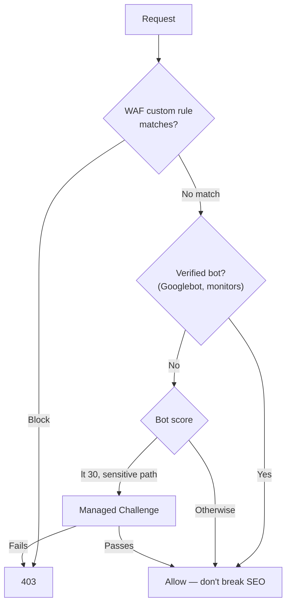

# Cloudflare — The Defender's Side

> **You've spent Week 6 getting past bot protection. Now put it in front of your own API and watch the traffic from the other side of the glass.**

⏱ ~9 min read · ~20 min hands-on
🔗 needs: [Cloudflare Bot Protection](/2026-02/docs/week-6/cloudflare-bot/) · [Cloudflare Tunnels](/2026-02/docs/week-2/10-cloudflare-tunnels/) · [FastAPI](/2026-02/docs/week-2/01-fastapi/)

Every API you ship will be scraped, credential-stuffed, and scanned. The defences you studied as obstacles in Week 6 are the ones you now have to *configure* — and the interesting part is that the goal is never "block all bots." It's to let the right ones through cheaply while making the wrong ones expensive.

## Try it in 5 minutes — add Turnstile to a form

[Turnstile](https://developers.cloudflare.com/turnstile/) is Cloudflare's CAPTCHA replacement: usually invisible, no image puzzles. It's free and works on any site, even one not proxied through Cloudflare.

**1. Widget in your HTML** (get a sitekey from the dashboard; `1x00000000000000000000AA` is the official always-passes test key):

```html
<form method="POST" action="/submit">
  <input name="email" type="email" required>
  <div class="cf-turnstile" data-sitekey="1x00000000000000000000AA"></div>
  <button type="submit">Sign up</button>
</form>
<script src="https://challenges.cloudflare.com/turnstile/v0/api.js" async defer></script>
```

**2. Verify server-side — this half is mandatory.** A token nobody validates is decoration:

```python
# /// script
# requires-python = ">=3.12"
# dependencies = ["fastapi>=0.110", "uvicorn>=0.27", "httpx>=0.28", "python-multipart>=0.0.9"]
# ///
"""Verify a Turnstile token server-side before trusting a submission.

Run:  uv run turnstile_api.py     then POST to http://127.0.0.1:8000/submit
"""

import os

import httpx
from fastapi import FastAPI, Form, HTTPException

app = FastAPI()
VERIFY = "https://challenges.cloudflare.com/turnstile/v0/siteverify"
# Official test secret that always passes. Replace with your real secret.
SECRET = os.environ.get("TURNSTILE_SECRET", "1x0000000000000000000000000000000AA")


@app.post("/submit")
async def submit(email: str = Form(...), cf_turnstile_response: str = Form("")):
    async with httpx.AsyncClient(timeout=10) as client:
        r = await client.post(
            VERIFY, data={"secret": SECRET, "response": cf_turnstile_response}
        )
    if not r.json().get("success"):
        raise HTTPException(403, "Challenge failed")
    return {"ok": True, "email": email}
```

✅ The browser solves the challenge; your server independently confirms it with Cloudflare. Skip step 2 and an attacker just omits the field.

## The three layers, and what each sees

| Layer | Sees | Use it to |
|---|---|---|
| **WAF custom rules** | Request metadata: path, method, IP, ASN, headers | Block known-bad, protect specific paths |
| **Bot Management** | A **bot score 1–99** from ML over global traffic | Challenge low scores on sensitive routes |
| **Turnstile** | Client-side browser signals | Prove a human is present at a form |

They compose. A typical rule challenges likely-bots on login while leaving your public blog and documented API alone:

```
(cf.bot_management.score lt 30
 and not cf.bot_management.verified_bot
 and http.request.uri.path eq "/login")
```

`cf.bot_management.verified_bot` is the crucial term — it exempts **known good bots** (Googlebot, Bingbot, uptime monitors). Forget it and you'll deindex yourself from search.



## Don't block what you meant to serve

The most common self-inflicted outage in bot management is over-blocking:

- **Log before you enforce.** Deploy rules in *Log* mode, read a week of matches, then switch to Block.
- **Exempt your own API.** Legitimate clients aren't browsers and will score low. Give them API keys and skip the challenge on `/api/*`.
- **Whitelist verified bots**, always.
- **Rate limits are gentler than blocks.** For scrapers that are merely enthusiastic, throttle instead of banning.

Rate limiting at the edge complements the application-level [backoff you built in Week 6](/2026-02/docs/week-6/rate-limits-retries-caching/) — same idea, opposite side.

> ⚖️ Deploy these on **your own** domain or a course sandbox. Configuring security products on infrastructure you don't control is unauthorised change, not learning.

## When it fails

| Symptom | Cause | Fix |
|---|---|---|
| Real users blocked | Rule too broad; no verified-bot exemption | Log mode first; add exemptions |
| Turnstile always passes | Using the test sitekey/secret | Swap in real credentials |
| Token accepted when absent | No server-side verification | Verify `siteverify` on every submit |
| Site disappears from Google | Blocked Googlebot | Add `not cf.bot_management.verified_bot` |
| Legit API clients challenged | Non-browser clients score low | Exempt `/api/*`; authenticate with keys |
| `cf.bot_management.*` unavailable | Field requires a paid plan | Use `cf.client.bot` / rate limiting on free |

## Your turn (≈20 min)

1. Add Turnstile to a form with the test keys; confirm the endpoint **rejects** a POST with no token.
2. Put a site behind Cloudflare (or use a [tunnel](/2026-02/docs/week-2/10-cloudflare-tunnels/)) and write one WAF rule in **Log** mode.
3. Hit it with a plain `httpx` script and then a browser; compare how each is scored/logged.
4. Point your own Week 6 scraper at it. You now know both sides — write three sentences on which defence was hardest to get past, and why.

## Checklist

- [ ] I always verify Turnstile tokens server-side.
- [ ] I can write a WAF rule combining bot score, verified-bot, and path.
- [ ] I exempt verified bots so I don't deindex myself.
- [ ] I deploy in Log mode before enforcing.
- [ ] I prefer rate limiting over outright blocking for merely-noisy clients.

## Go deeper

- [Turnstile docs](https://developers.cloudflare.com/turnstile/) and [server-side validation](https://developers.cloudflare.com/turnstile/get-started/server-side-validation/).
- [Integrating Turnstile, WAF & Bot Management](https://developers.cloudflare.com/turnstile/tutorials/integrating-turnstile-waf-and-bot-management/) — the three layers together.
- [Allow traffic from verified bots](https://developers.cloudflare.com/waf/custom-rules/use-cases/allow-traffic-from-verified-bots/) — the exemption that saves your SEO.

<!-- SOURCES: https://developers.cloudflare.com/turnstile/ , https://developers.cloudflare.com/turnstile/get-started/server-side-validation/ , https://developers.cloudflare.com/turnstile/tutorials/integrating-turnstile-waf-and-bot-management/ , https://developers.cloudflare.com/waf/custom-rules/use-cases/allow-traffic-from-verified-bots/ , https://developers.cloudflare.com/bots/get-started/bot-management/ -->
