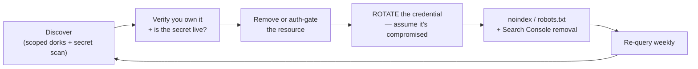

# Dorking for Recon & Exposure

> **Search engines have already indexed your mistakes. Find them before someone else does — on domains you own.**

⏱ ~9 min read · ~20 min hands-on
🔗 needs: [Google Dorking](/2026-02/docs/week-6/google-dork/) · [OWASP LLM Top 10](/2026-02/docs/week-7/05-owasp-llm-top-10/)

[Week 6](/2026-02/docs/week-6/google-dork/) taught operators as a *sourcing* skill. The same operators are the first tool in an attacker's kit — and therefore the first in a defender's. This page is about **auditing your own external footprint**.

> ⚖️ **Scope rule, no exceptions.** Every query on this page is prefixed with a `site:` you own or are contractually authorised to test. Running exposure dorks against third parties, then acting on what you find, is unauthorised access in most jurisdictions — and it is never a course exercise. See [Legal & Ethical Scraping](/2026-02/docs/week-6/legal-ethical-scraping/).

## Try it in 5 minutes — audit your own footprint

Pick a domain you control (your GitHub Pages site, a personal domain). Run:

```
site:yourdomain.com                          → everything indexed. More than you expected?
site:yourdomain.com -inurl:https             → anything still served over plain HTTP
site:yourdomain.com filetype:pdf             → documents you may have forgotten
site:yourdomain.com intitle:"index of"       → browsable directory listings
site:yourdomain.com inurl:admin | inurl:login → exposed admin surfaces
```

✅ That's your public attack surface as a search engine sees it. Most people find at least one surprise.

## Exposure classes worth checking

The [Google Hacking Database](https://www.exploit-db.com/google-hacking-database) catalogues these patterns. Treat it as a **checklist of classes**, not a script to run against strangers:

| Class | What it means | Why it's serious |
|---|---|---|
| Directory listings | Auto-generated `index of /` pages | Backups, exports, and internal docs become browsable |
| Config / env files | `.env`, `web.config`, `.git/` served publicly | Live credentials, often still valid |
| Open object storage | World-readable S3/GCS/Azure buckets | The classic dataset and PII leak |
| Debug/status endpoints | Stack traces, `/phpinfo`, health pages with internals | Free reconnaissance on your stack |
| Documents with metadata | PDFs/DOCX carrying authors, paths, software | Internal usernames and directory structure |

## Secrets leak from repos far more often than from webroots

Dorking finds what search engines indexed; most credential leaks happen in **git history** — including commits that were "removed" but never rewritten. Scan your own repos:

```bash
# Verify whether found credentials are actually live (deep, verification-focused)
uvx trufflehog git file://. --results=verified

# Fast scan, good as a pre-commit gate
uvx gitleaks detect --source . --verbose
```

Rough guide from 2026 comparisons: **TruffleHog** leads on verified detection of live credentials, **Gitleaks** is fast enough to block commits, and **GitHub secret scanning** covers partner formats well but far less for custom ones. Use at least two layers.

**Secrets escape beyond git too** — Slack messages, Jira tickets, Docker images, paste sites, even preprint PDFs. And a 2026 finding worth internalising: AI-assisted commits leak secrets at roughly **twice** the baseline rate, so `git diff` before you commit what an agent wrote.

## The remediation loop

Finding it is a quarter of the job:



**Rotation is non-negotiable.** Deleting a file doesn't un-leak a key — search caches, forks, and archives ([Wayback](/2026-02/docs/week-6/wayback-commoncrawl/), Common Crawl) keep copies. Treat any exposed credential as burned.

Removing a page from your site doesn't clear the index either — use [Google Search Console](https://search.google.com/search-console) removals, and add `noindex` so it doesn't return.

## When it fails

| Symptom | Cause | Fix |
|---|---|---|
| `site:` shows fewer pages than exist | Index estimates are approximate | Cross-check with your sitemap |
| Removed the file, still in results | Index/cache lag | Search Console removal + `noindex` |
| Scanner floods you with findings | Entropy false positives (hashes, UUIDs) | Prefer verified results; tune allowlists |
| `robots.txt` used to hide a secret path | `robots.txt` is **public** and advertises it | Authenticate the resource; never rely on obscurity |
| Rotated the key, breach continues | Another copy elsewhere | Search forks, archives, images, and CI logs |

## Your turn (≈20 min)

1. Run the five audit queries against a domain you own. Write down anything unexpected.
2. Run `gitleaks` and `trufflehog` over one of your own repos; compare their findings.
3. For one finding (real or hypothetical), write the full remediation loop — including *which* credential you'd rotate and who you'd notify.
4. Add a secret-scanning step to a [GitHub Actions workflow](/2026-02/docs/week-7/01-github-actions-advanced/) so it runs on every push.

## Checklist

- [ ] I only run exposure dorks scoped to domains I own or am authorised to test.
- [ ] I can name the common exposure classes and why each matters.
- [ ] I scan git history for secrets, not just the current tree.
- [ ] I know deletion is not remediation — I **rotate** exposed credentials.
- [ ] I know `robots.txt` is public and never hides anything.

## Go deeper

- [Google Hacking Database — Exploit-DB](https://www.exploit-db.com/google-hacking-database) — the pattern catalogue.
- [TruffleHog](https://github.com/trufflesecurity/trufflehog) · [Gitleaks](https://github.com/gitleaks/gitleaks) — the two scanners to run.
- [GitHub secret scanning](https://docs.github.com/en/code-security/secret-scanning/introduction/about-secret-scanning) — the free layer on every repo.
- [Search Console removals](https://search.google.com/search-console) — getting it out of the index.

<!-- SOURCES: https://www.exploit-db.com/google-hacking-database , https://github.com/trufflesecurity/trufflehog , https://github.com/gitleaks/gitleaks , https://docs.github.com/en/code-security/secret-scanning/introduction/about-secret-scanning , https://search.google.com/search-console -->
