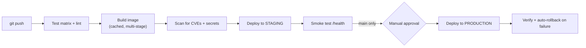

# Lab — Full CI/CD Pipeline to Cloud Run

> One `git push` → tests, image build, deploy, health check. Plus the parts people skip: a rollback, a cost cap, and an approval gate.

⏱ ~4–5 hours
🔗 needs: [GitHub Actions Advanced](/2026-02/docs/week-7/01-github-actions-advanced/) · [Advanced Docker](/2026-02/docs/week-7/02-advanced-docker/) · [Serverless Functions](/2026-02/docs/week-7/07-serverless-functions/)

Everything in Week 7 assembled into one working pipeline.

## What you're building

## Requirements

**1. The app.** Any small FastAPI service with `/health` and one real endpoint. Reuse your Week 6 scraper API or the Week 7 hardened LLM service.

**2. Container.** Multi-stage, `-slim`, non-root user, `.dockerignore`, `$PORT` from the environment. Record the final image size in your README — under 300 MB is a reasonable target for a Python API.

**3. CI on every push and PR.**
- Test matrix across two Python versions, `fail-fast: false`
- Lint (`ruff`) and a secret scan (`gitleaks`)
- Dependency caching, with a cold-vs-warm timing comparison in the README
- `permissions: contents: read` by default

**4. CD with two environments.**
- Every push to `main` deploys to **staging** automatically
- Production requires a **manual approval** via a GitHub Environment with a required reviewer
- Authenticate to GCP with **Workload Identity Federation**, not a long-lived JSON key ([docs](https://github.com/google-github-actions/auth)) — and say in your README why a committed service-account key would be worse

**5. Verify and roll back.** After deploying, poll `/health`. If it fails, the workflow must **automatically route traffic back** to the previous Cloud Run revision and fail the run. Demonstrate this: deliberately deploy a broken build and show the rollback in the Actions log.

**6. Guard the cost.** `--max-instances` set, plus a billing budget alert ([Cost Alerting](/2026-02/docs/week-7/09-cost-alerting/)). Screenshot the budget config.

## Deliverables

| # | Item |
|---|---|
| 1 | Repo with the app, Dockerfile, and workflows |
| 2 | Actions history showing: a passing run, a **failed deploy that rolled back**, and an approved production deploy |
| 3 | Live staging and production URLs (or a documented teardown) |
| 4 | README: image size, cold vs warm CI timings, and the rollback explanation |
| 5 | Screenshot of the budget alert and max-instances setting |

## Grading

| Weight | Criterion |
|---|---|
| 25% | **Pipeline works** — push to deploy, both environments |
| 25% | **Rollback demonstrated** — a real failed deploy that recovered automatically |
| 20% | **Security** — WIF (no static keys), least-privilege permissions, image + secret scanning |
| 15% | **Speed** — layer and dependency caching with measured evidence |
| 15% | **Cost control** — max instances, budget alert, and a teardown plan |

The rollback is the highest-signal deliverable. Anyone can deploy when everything works; the pipeline earns its keep on the day the build is broken.

## Common failure modes

| Symptom | Cause | Fix |
|---|---|---|
| `Permission denied` deploying | Missing IAM role / WIF misconfigured | Grant Cloud Run Admin + Service Account User |
| Container won't start | Bound `127.0.0.1` or hard-coded port | `0.0.0.0` + `$PORT` |
| Deploy "succeeds" but the app is broken | No post-deploy verification | Poll `/health`, fail the job |
| Rollback doesn't restore service | Traffic not re-routed to the old revision | `gcloud run services update-traffic --to-revisions=` |
| Every build is slow | No caching | `cache-from/to: type=gha` |
| Production deployed by accident | No environment gate | Required reviewers on the production environment |

## Stretch goals

- Declare the Cloud Run service and budget in [Terraform](/2026-02/docs/week-7/08-terraform-iac/) instead of `gcloud` flags.
- Add a canary: send 10% of traffic to the new revision, promote only if error rates hold.
- Post the image size and CI duration as a comment on every PR.
