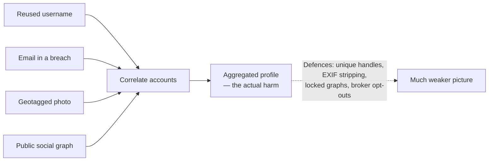

# Person & Social OSINT

> **The same techniques that profile a person will show you what the internet already knows about *you*. Learn both halves — and practise only on yourself.**

⏱ ~10 min read · ~25 min hands-on
🔗 needs: [OSINT — Infrastructure & Records](/2026-02/docs/week-6/osint/) · [Legal & Ethical Scraping](/2026-02/docs/week-6/legal-ethical-scraping/)

[Week 6](/2026-02/docs/week-6/osint/) scoped OSINT to domains, certificates, and corporate records. This page covers the part aimed at **people** — because you cannot defend against a technique you don't understand, and because as a data scientist you will be handed personal datasets and asked what's safe to publish.

> ⚖️ **Read this before anything else on the page.**
>
> - **Every exercise here targets *you*.** Your own accounts, your own photos, your own footprint. Not a classmate, not an ex, not a public figure, not "just to see if it works."
> - **Aggregation is the harm.** Each fact may be public; assembling them into a dossier creates a capability that didn't exist before. Courts and regulators treat the compilation, not the components.
> - **Profiling a person without a lawful basis breaches GDPR and India's DPDP Act** — and stalking/harassment laws apply regardless of how public the data was. [Clearview's €20M fines](/2026-02/docs/week-6/legal-ethical-scraping/) came from scraping *public* photos.
> - **This is not a graded assignment on real people.** If work requires it, you need a written brief, a defined question, and your instructor's sign-off.

## Try it in 25 minutes — a self-OSINT audit

Do exactly what an investigator would do, with yourself as the target. Most students find something they'd rather remove.

**1. Username reach.** Pick a handle you've used for years. [WhatsMyName](https://whatsmyname.app/) checks it across hundreds of sites. Reused handles are the single strongest link between otherwise-separate identities.

**2. Email exposure.** Check your addresses on [Have I Been Pwned](https://haveibeenpwned.com/). Each breach reveals which services you hold accounts with — and old breaches often carry passwords you may still be reusing.

**3. Your own photo metadata.** Phone photos frequently embed GPS coordinates:

```python
# /// script
# requires-python = ">=3.12"
# dependencies = ["pillow>=10.0"]
# ///
"""Show what your own photos reveal. Run it on a photo from your phone.

Run:  uv run my_exif.py photo.jpg
"""

import sys

from PIL import Image, ExifTags

img = Image.open(sys.argv[1] if len(sys.argv) > 1 else "photo.jpg")
exif = img.getexif()

for tag_id, value in exif.items():
    print(f"{ExifTags.TAGS.get(tag_id, tag_id):25} {value}")

gps = exif.get_ifd(ExifTags.IFD.GPSInfo)
if gps:
    print("\n⚠️  GPS DATA PRESENT:")
    for tag_id, value in gps.items():
        print(f"  {ExifTags.GPSTAGS.get(tag_id, tag_id):22} {value}")
    print("  → These are coordinates. Strip them before you post.")
else:
    print("\n✅ No GPS in EXIF.")
```

**4. Search yourself.** `"Your Name" site:linkedin.com`, your name + your city, your phone number in quotes. Note what a stranger could assemble in ten minutes.

✅ You now have your own exposure report — and a to-do list.

## The technique categories

| Category | How it works | Your defence |
|---|---|---|
| **Username correlation** | One reused handle links accounts across platforms | Use distinct handles for distinct contexts |
| **Email/breach data** | Breach corpora map addresses → services → old passwords | Unique passwords, a manager, HIBP alerts |
| **Social graph** | Friends/followers reveal employer, family, location | Lock down follower lists; audit tagged posts |
| **Image metadata** | EXIF GPS, timestamps, camera serials | Strip EXIF — [Image Processing Pipeline](/2026-02/docs/week-6/image-processing-pipeline/) |
| **Visual geolocation** | Signage, plates, skylines, shadows locate a photo | Think about backgrounds before posting |
| **Data brokers** | Aggregators sell compiled profiles | File opt-outs; they're legally required in many regions |

The lesson underneath: **correlation is the attack**. No single item is sensitive. Handle + breach + a geotagged photo + an employer is a complete picture of a person's life.



## What this means for your data work

You will be handed datasets containing people. Carry three habits across:

- **Data minimisation.** Collect only fields your defined question needs. "It might be useful later" is how leaks happen.
- **Re-identification is easier than it looks.** Removing names isn't anonymisation; a handful of quasi-identifiers (postcode, birth date, gender) frequently re-identifies individuals. Aggregate, generalise, or don't publish.
- **Redact before sharing.** Strip personal columns from notebooks, screenshots, and sample data before they go in a repo or a slide.

## When it fails

| Trap | Why | Do instead |
|---|---|---|
| Assuming a match is the same person | Common names, recycled handles | Corroborate across ≥2 independent sources; state confidence |
| Trusting broker data | Aggregators are frequently wrong and stale | Treat as an unverified lead, never a finding |
| Acting on a breach record | Old, mixed, or fabricated corpora | Never contact or accuse based on breach data |
| "It's public, so it's fine" | Aggregation and purpose are what regulators judge | Ask what question justifies collecting it |
| Keeping the dossier | Storage is its own liability | Delete after the exercise |

## Your turn (≈25 min)

1. Complete the four self-audit steps above.
2. Write an **exposure report on yourself**: what's findable, how it correlates, and your confidence in each item.
3. Take three concrete actions — strip EXIF from a photo you posted, change a reused handle, enable HIBP alerts, or file one broker opt-out.
4. Write one paragraph: *if you were handed a scraped dataset of 10,000 real people, what would you check before doing anything with it?*
5. **Delete anything you gathered** when you're done.

## Checklist

- [ ] I understand that aggregation — not any single fact — is the harm.
- [ ] I audited my own footprint and reduced it.
- [ ] I know EXIF can carry GPS, and I strip it before posting.
- [ ] I corroborate identity claims across independent sources and state confidence.
- [ ] I apply data minimisation and know pseudonymisation ≠ anonymisation.
- [ ] I never run these techniques against another person without a written, lawful basis.

## Go deeper

- [Have I Been Pwned](https://haveibeenpwned.com/) — breach exposure and alerts for your addresses.
- [WhatsMyName](https://whatsmyname.app/) — username enumeration, and a lesson in handle reuse.
- [OSINT Framework](https://osintframework.com/) — a map of the tooling landscape.
- [India's DPDP Act](/2026-02/docs/week-6/legal-ethical-scraping/) and GDPR — the rules that govern all of the above.

<!-- SOURCES: https://haveibeenpwned.com/ , https://whatsmyname.app/ , https://osintframework.com/ . Exercises deliberately self-directed; no third-party targeting. -->
