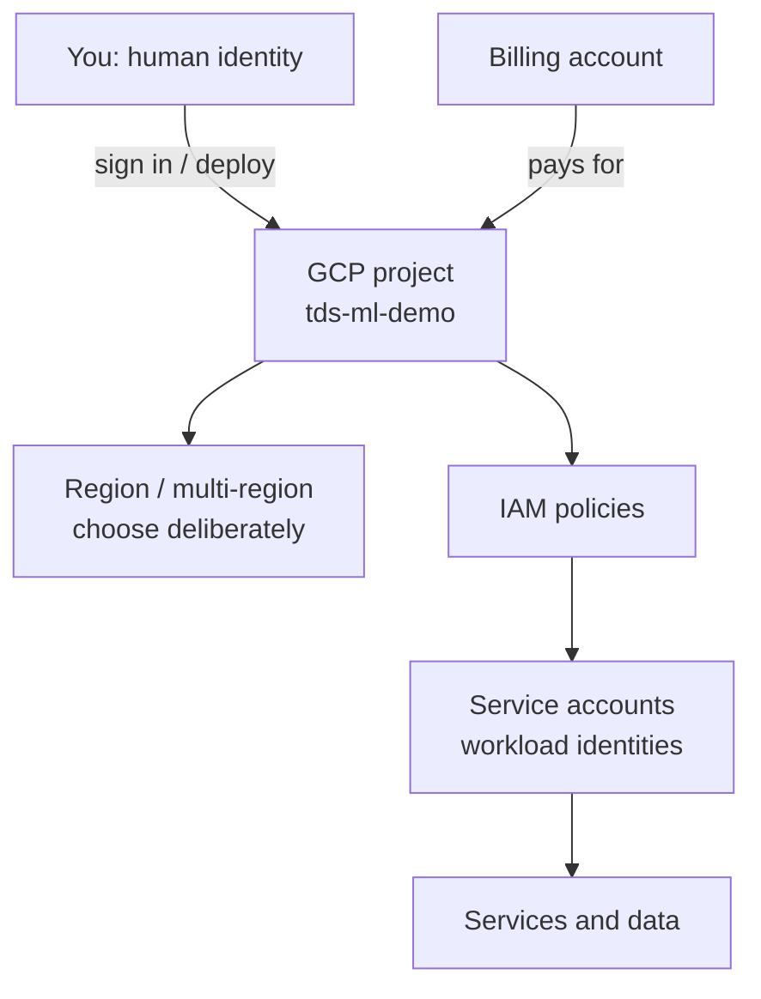
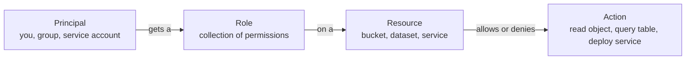
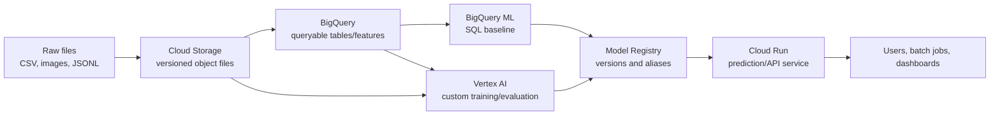
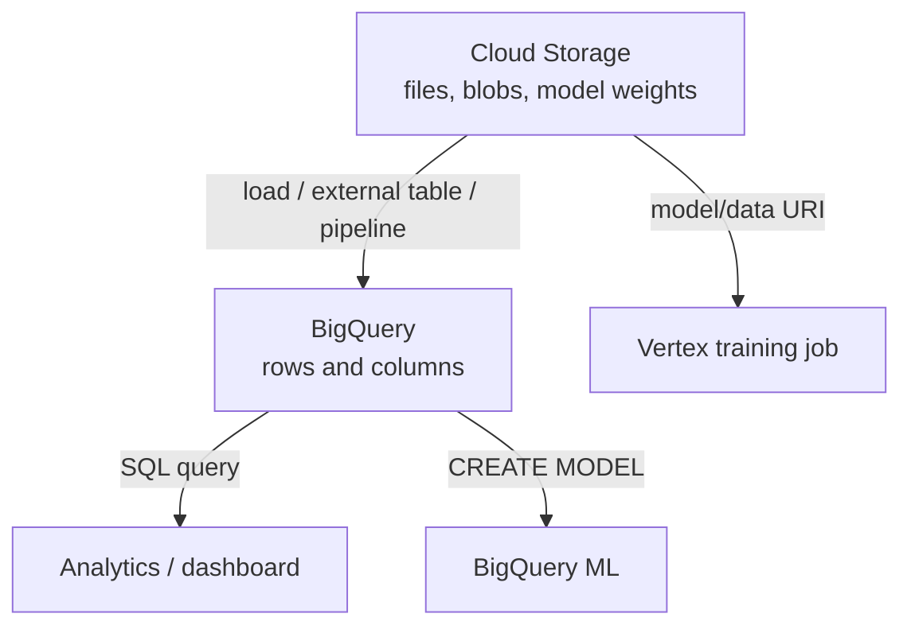
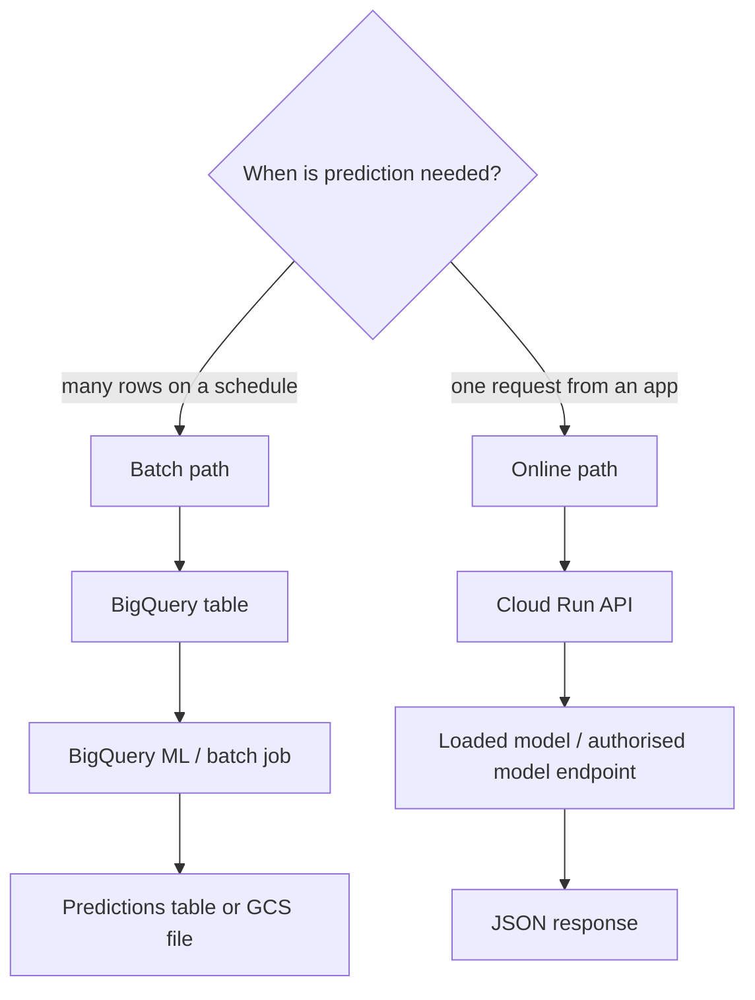
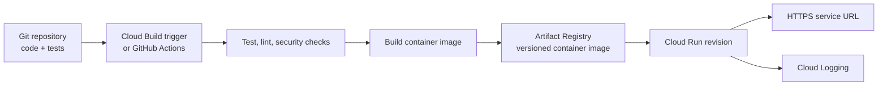
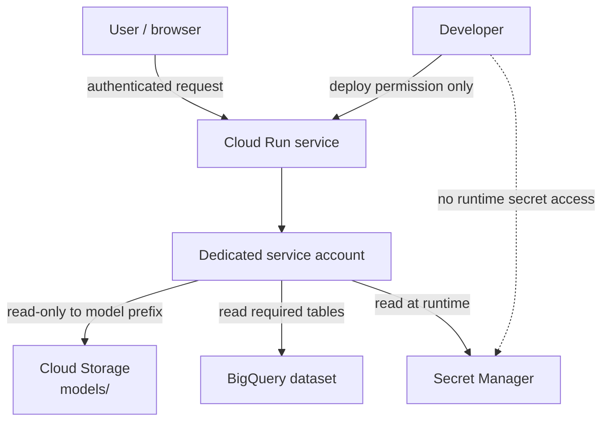
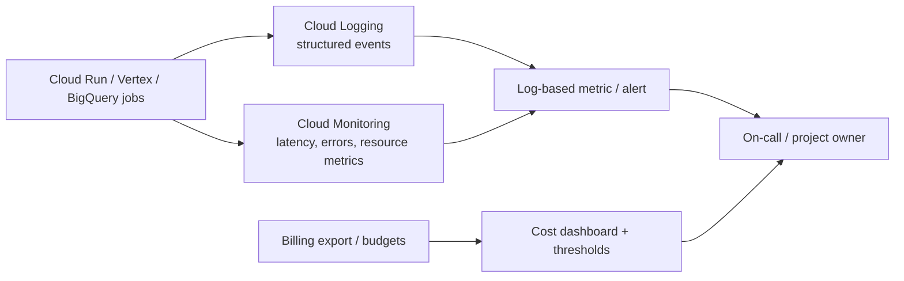

+++
aliases = ["/2026-02/docs/week-8/09-full-gcp-walkthrough/"]
+++

# Milestone: Full GCP Walkthrough

<!-- Week 8 milestone walkthrough. -->

> **GCP is not one big computer in the cloud. It is a set of managed services, identities, regions, bills, and logs. Your job is to connect only the few pieces your product needs—and be able to explain every connection.**

⏱ ~18 min read · ~45 min guided walkthrough
🔗 needs: [Cloud Storage for ML](/2026-02/docs/week-8/01-cloud-storage-ml/) · [BigQuery ML](/2026-02/docs/week-8/02-bigquery-ml/) · [Cost Alerting & Budgets](/2026-02/docs/week-7/09-cost-alerting/)

This is a **milestone, not a lab**. You do not need to create every service below. Walk through the Console, read the diagrams left-to-right, and be able to choose the smallest architecture for your own project. Create resources only after setting a budget and deciding where they will be deleted.

## 1. The foundation: project, billing, location, identity

Every GCP resource belongs to a project. The project is the practical boundary for APIs, IAM permissions, logs, labels, and billing. A billing account pays for its usage; it is not a shared “free tier switch.”

| Foundation tool | What it does | Beginner rule |
|---|---|---|
| **Resource Manager / Project** | owns resources, API enablement, IAM, and labels | use a separate project for experiments when possible |
| **Cloud Billing + Budgets** | attributes cost and sends threshold alerts | set a budget before enabling paid experiments |
| **Regions / locations** | decide where data/compute run | keep connected services near each other; location mistakes are hard to undo |
| **IAM** | controls who can do what on which resource | grant the smallest role at the narrowest useful scope |
| **Service accounts** | non-human identities for workloads | give Cloud Run/Vertex a dedicated identity; avoid downloaded key files |
| **Secret Manager** | stores runtime secrets | use it for API keys; never put secrets in code, images, or notebooks |

### IAM is three nouns

For example, an API service may need to read one model file from one bucket. It does **not** need `Owner` on the whole project. A service account is like a robot employee: it has every permission you grant it, even if your code only uses one.

> ⚖️ Prefer an attached service account or short-lived credentials over a JSON service-account key. If a key is exposed, treat it as a compromised password: revoke/rotate it immediately.

## 2. The data and ML path

This is a common, not mandatory, architecture. It fits tabular/batch ML. A fine-tuned LLM path may use a model registry and Cloud Run without BigQuery ML; a data-analysis project may stop at BigQuery.

| Service | One important feature | Use it first for |
|---|---|---|
| **Cloud Storage (GCS)** | durable object storage addressed as `gs://bucket/object` | raw files, model artefacts, exports, checkpoints |
| **BigQuery** | serverless SQL warehouse with separate storage/compute | large structured tables, analysis, feature queries |
| **BigQuery ML** | `CREATE MODEL`, `ML.EVALUATE`, and `ML.PREDICT` in SQL | a fast tabular ML baseline near warehouse data |
| **Vertex AI** | managed ML workbench/training/evaluation/registry ecosystem | custom ML/LLM jobs that outgrow SQL or a notebook |
| **Model Registry** | records model versions and deployment aliases | promoting a tested model rather than “latest file wins” |
| **Cloud Run** | deploys a container HTTP service and can scale to zero | a small API, inference endpoint, webhook, or demo backend |

### Storage and table data are different

Do not upload a 10 GB CSV to Git. Do not expect GCS to run SQL over arbitrary files like a warehouse. Use each tool for its job, and record immutable data/model versions so another run can be reproduced.

## 3. Two ways to make predictions

Choose the shape of the question before choosing a service.

| Pattern | Good example | Watch out for |
|---|---|---|
| **Batch prediction** | score all customers overnight | data freshness, query cost, output-table retention |
| **Online prediction** | classify a ticket while a user waits | latency, authentication, cold starts, input validation |
| **Human-in-the-loop** | triage/recommendation is reviewed before action | make the uncertainty/escalation path explicit |

A batch job is often simpler and cheaper. Do not deploy an API merely because “production” sounds like a URL.

## 4. Build and deploy the application path

Source code is not a deployed service. A simple container delivery path looks like this:

| Service | One important feature | Beginner rule |
|---|---|---|
| **Cloud Build** | runs defined build steps and can trigger from source changes | tests must run before an image is promoted |
| **Artifact Registry** | stores versioned container images/packages | deploy a digest/version, not an untraceable local image |
| **Cloud Run** | runs a container behind HTTPS with revision history and scale controls | bind to `$PORT`, set a max-instances cap, authenticate by default |
| **Cloud Scheduler** | invokes a task on a schedule | use it for scheduled batch/refresh work, with retry/idempotency design |
| **Pub/Sub** | decouples producers from asynchronous consumers | use it for events/queues, not as a replacement for a database |

The Cloud Build → Artifact Registry → Cloud Run sequence is useful because every deployed revision can be traced back to an image and a source/build record.

## 5. Security boundaries in a small project

This diagram is an aim, not a command list. Separate identities reduce blast radius:

- **Developer identity:** can deploy/review, but does not need production data by default.
- **Runtime service account:** reads only the bucket prefix/dataset/secret the service needs.
- **CI identity:** builds/deploys but cannot casually impersonate every service account.

Start without public access if possible. If an endpoint must be public, validate input, authenticate users where applicable, rate-limit/monitor it, and never put privileged service-account keys in the container.

## 6. Observe and control the system after it works

| Tool | One important feature | First thing to do |
|---|---|---|
| **Cloud Logging** | collects platform/app logs and lets you search them | write structured logs with request ID, status, latency—never secrets |
| **Cloud Monitoring** | dashboards, metrics, uptime/error/latency alerts | alert on a small number of actionable symptoms |
| **Error Reporting / Trace** | groups failures and follows a request across services | use when debugging errors/latency becomes hard |
| **Billing budgets / export** | spending thresholds and cost analysis | set budget alerts and label resources by project/env/owner |

Logs tell you **what happened**; metrics tell you **how often/how much**; traces show **where time went**; budgets tell you **what it cost**. None of them replace an in-code limit such as a max request size, retry cap, or Cloud Run `--max-instances` setting.

## A 45-minute console walkthrough

Do this with a blank/low-risk GCP project. Reading a page does not create a bill; enabling APIs, training models, storing data, and sending traffic can.

1. **Project and billing:** open Project Selector → Billing. Identify project ID, billing account, and budget/alert status.
2. **IAM:** open IAM & Admin. Identify your role and any default service accounts. Explain why `Owner` is not a runtime role.
3. **Storage:** open Cloud Storage. Identify bucket location, objects, versioning, lifecycle policy, and who has access.
4. **BigQuery:** open BigQuery. Inspect a public dataset, query only selected columns with a small `LIMIT`, and read the bytes-processed estimate before running.
5. **Vertex AI:** open the dashboard. Locate Workbench, training, evaluation, and Model Registry. Do not start a job merely to see a screen.
6. **Artifact Registry and Cloud Run:** find an image repo and service revision (or read their pages). Explain what image/version the revision would run.
7. **Logs and Monitoring:** open Logs Explorer and locate one platform event; find the matching metric/dashboard area.
8. **Clean up:** list resources you created and delete experiments you no longer need. Check billing later; deletion/retention behaviour varies by service.

## Pick the smallest architecture

| Your goal | Start with | Add only if needed |
|---|---|---|
| Explore a CSV and train a simple tabular baseline | BigQuery + BigQuery ML | GCS when files are larger/reusable; Vertex for custom training |
| Fine-tune an open model for a course demo | notebook/Unsloth + private GCS artefact store + MLflow | Vertex when you need managed training/registry at scale |
| Expose a safe prediction API | Cloud Run + secret/IAM + logs | Artifact Registry/Cloud Build for repeatable delivery; Pub/Sub for async work |
| Run a nightly score | BigQuery scheduled query or Scheduler-triggered job | Pub/Sub only when decoupled event processing is actually needed |

The best architecture for a beginner is often: **one project, one region, one bucket, one dataset, one service account, one small service, one budget, and one deletion plan**.

## Milestone: explain your GCP design

You have completed this milestone when you can draw your own 6–10 box diagram and answer:

- [ ] Which project, region, and billing account own the system?
- [ ] Where do raw data, tables, model artefacts, and predictions live?
- [ ] Is prediction batch, online, or human-reviewed—and why?
- [ ] Which identity reads each resource? What is the narrowest role it needs?
- [ ] Which code/image/model version is deployed?
- [ ] Where would you look for an error, latency spike, or unexpected cost?
- [ ] What resources will you delete, and when?

## When it fails

| Symptom | Likely cause | Fix |
|---|---|---|
| `Permission denied` | wrong identity/role or wrong project | identify the active principal, resource, and exact action; grant the smallest role needed. |
| Data/model service cannot see a resource | location mismatch or missing service-account access | align locations where required; grant access to the runtime identity, not your personal account. |
| Cloud Run starts then fails | service does not listen on `$PORT`, image/config is wrong, or dependency missing | read revision logs, reproduce locally, fix image, redeploy a new revision. |
| Bill rises unexpectedly | unbounded queries, storage retention, GPUs, egress, retries, or autoscaling | inspect billing, set budgets/caps/lifecycle rules, label resources, delete unused work. |
| Architecture is too complicated to explain | added services before proving the need | remove components; begin with the smallest end-to-end slice. |

## Go deeper

- [IAM overview](https://cloud.google.com/iam/docs/overview) and [service-account overview](https://cloud.google.com/iam/docs/service-account-overview) — identity and least privilege.
- [Cloud Build overview](https://cloud.google.com/build/docs/overview) and [Cloud Build → Cloud Run deployment](https://cloud.google.com/build/docs/deploying-builds/deploy-cloud-run) — repeatable delivery.
- [BigQuery storage overview](https://cloud.google.com/bigquery/docs/storage_overview) — managed analytical tables and separated compute/storage.
- [Cloud Logging overview](https://cloud.google.com/logging/docs/overview) — logs, alerts, retention, and routing.
- [Cost Alerting & Budgets](/2026-02/docs/week-7/09-cost-alerting/) — set limits before experiments.

<!-- SOURCES: https://cloud.google.com/iam/docs/overview , https://cloud.google.com/iam/docs/service-account-overview , https://cloud.google.com/build/docs/overview , https://cloud.google.com/build/docs/deploying-builds/deploy-cloud-run , https://cloud.google.com/bigquery/docs/storage_overview , https://cloud.google.com/logging/docs/overview -->
